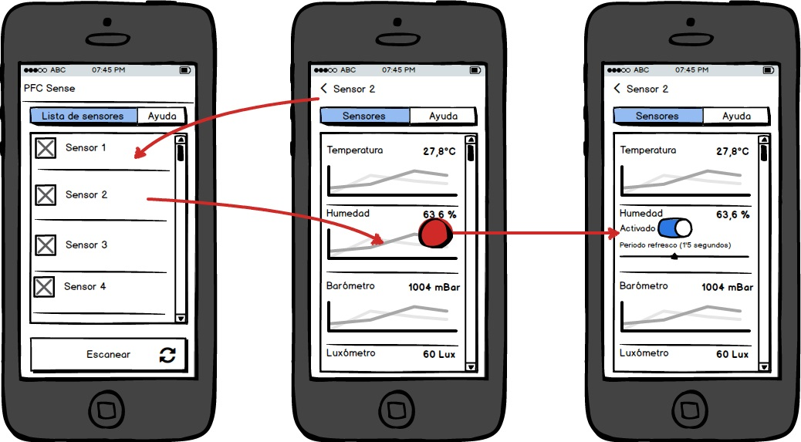
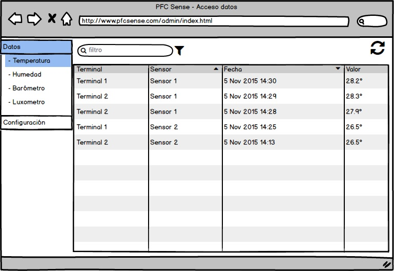
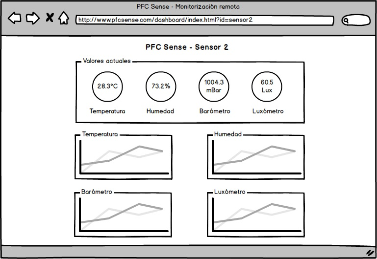

# Análisis de la interfaz de usuario

Una vez realizados los diseños tanto del modelo como de los controladores, el siguiente paso es diseñar la interfaz que va a ser necesaria. Para la solución completa será necesario realizar tres diseños de interfaz, el de la aplicación móvil, el del entorno de administración web de acceso a datos y el dashboard de monitorización de los sensores.

## Diseño de la aplicación móvil

###### *Figura 1: Mockup la UI de la aplicación móvil*

## Diseño del entorno de administración web

###### *Figura 2: Mockup la UI del entorno de administración web*

## Diseño del dashboard de monitorización

###### *Figura 1: Mockup la UI de la aplicación móvil*