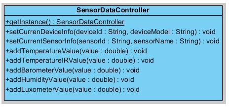
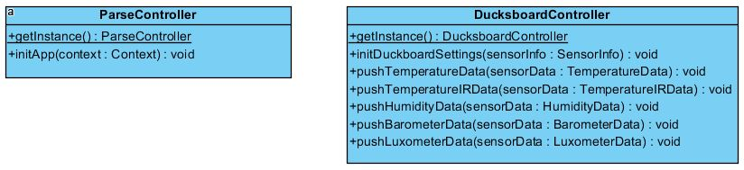

# 4.4. Análisis de los controladores

Ya teniendo el diseño de como va a ser el modelo de datos, el siguiente paso es diseñar qué controladores vamos a necesitar para el manejo de la aplicación y cuales van a ser utilidad. Por un lado tenemos el controlador que se encarga de manejar cuando hemos recibido nuevos valores desde los sensores que se observa en la Figura 4.4.1. Este controlador se encargará de procesarlos y llamar a los controladores de Parse y Ducksboard cuando corresponda.

###### *Figura 4.4.1: Diagramas de clase del controlador de tratamiento de valores de los sensores*

La Figura 4.4.2 muestra el diseño de diagramas de clase de los controladores que se encargan de la configuración de Parse y del envío de datos al panel de Ducksboard.

###### *Figura 4.4.2: Diagramas de clase de los controladores de Parse y Ducksboard*