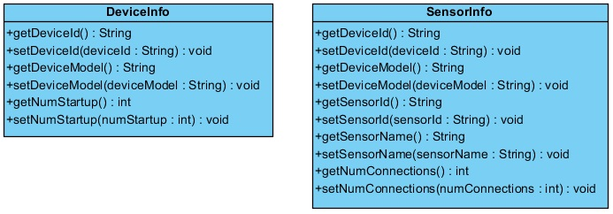
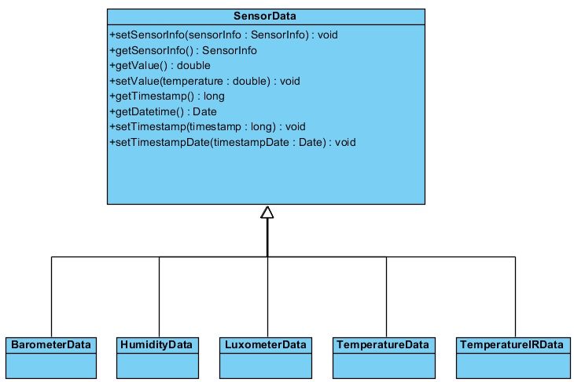

# 4.3. Análisis del modelo de datos

Tras analizar los requerimientos que tenemos de la aplicación llegamos a la conclusión de que principalmente el modelo se compondrá de las clases donde guardaremos los valores que nos devuelven los sensores. Por lo tanto, cada uno de estos valores estará asociado a un sensor, que a su vez estará asociado a un terminal. 

Como los datos de sensores son de diferente tipo y queremos persistirlos en tablas separadas para su mejor análisis, diseñaremos una serie de objetos que heredaran de una clase común donde almacenaremos principalmente el valor que nos devuelve el sensor y la fecha en la que se tomó dicho valor.

###### *Figura 1: Diagramas de clase de DeviceInfo y SensorInfo*

###### *Figura 2: Diagramas de clase de SensorData y sus clases hijas*