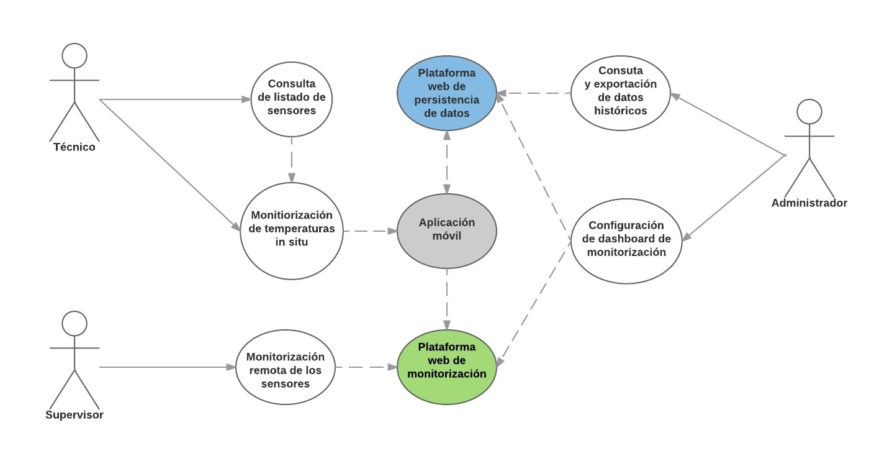

# Casos de uso

Con los requisitos y actores correctamente definidos, procederemos a identificar los distintos casos de uso, que podremos ver de forma general en el siguiente diagrama.

###### *Figura 1: Casos de uso*

A continuación veremos un listado detallado de los casos de uso:

## Consulta de listado de sensores

| Caso de uso | Consulta de listado de sensores |
| -- | -- |
| **Descripción** | Al acceder a la aplicación debe mostrarse un listado con los sensores disponibles. Además debe proporcionarse la posibilidad de refrescar dicho listado |
| **Actor** | Técnico |
| **Precondiciones** | El usuario debe encontrarse en la pantalla de inicio de la aplicación |
| **Postcondiciones** | Se muestra el listado de sensores disponibles |
| **Flujo** | El usuario arranca la aplicación y se muestra el listado |
| **Flujo Alternativo** | Si el usuario vuelve de la pantalla de monitorización debe mostrarse de nuevo el listado |
| **Información adicional** | Se debe información descriptiva sobre el sensor para poder seleccionarlo convenientemente como puede ser su nombre, su dirección mac, una imagen identificativa, etc |

## Monitorización de temperaturas in situ

| Caso de uso | Monitorización de temperaturas in situ |
| -- | -- |
| **Descripción** | Debe mostrarse la información de los servicios que devuelve el sensor al que se está conectado |
| **Actor** | Técnico |
| **Precondiciones** | El usuario debe haber seleccionado un sensor de la lista de sensores disponibles |
| **Postcondiciones** | Se muestran los valores de lo servicios del sensor a los que se está conectado. Además de una gráfica con la evolución de los valores con respecto al tiempo transcurrido |
| **Flujo** | El selecciona un sensor de la lista y arranca la conexión al mismo y la monitorización de los valores que devuelve |
| **Información adicional** | Se debe información descriptiva sobre el servicio a los que se está conectado, su valor actual y una gráfica con el histórico de valores |

## Consulta y exportación de datos históricos

| Caso de uso | Consulta y exportación de datos históricos |
| -- | -- |
| **Descripción** | Debe proporcionarse un entorno web donde puedan consultarse la información de los valores de los diferentes servicios que proporciona el sensor. Esto datos podrán exportarse en un formato adecuado para poder integrados en otras plataformas |
| **Actor** | Administrador |
| **Precondiciones** | Para acceder al entorno de administración y consulta de datos será necesario autentificarse con un usuario previamente configurado |
| **Postcondiciones** | Se mostrarán los datos enviados por los diferentes sensores. Además se podrá acotar la consulta de los datos mediante filtros de busqueda |
| **Flujo** | Se acce |
| **Información adicional** | Las gráficas deben proporcionar los valores en tiempo real sin necesidad de refresco |

## Monitorización remota de los sensores

| Caso de uso | Monitorización remota de los sensores |
| -- | -- |
| **Descripción** | Debe proporcionarse un panel web donde aparezcan una serie de gráficas que muestren tanto los valores actuales de un sensor como la evolución de los valores |
| **Actor** | Supervisor |
| **Precondiciones** | El administrador debe haber configurado el panel de muestreo de información de los diferentes sensores |
| **Postcondiciones** | Se muestran los valores de lo servicios del sensor a los que se está conectado. Además de sus correspondientes gráficas con la evolución de los valores con respecto al tiempo transcurrido |
| **Flujo** | Acceso mediante una url de monitorización web previantente proporcionada |
| **Información adicional** | Las gráficas deben proporcionar los valores en tiempo real sin necesidad de refresco |