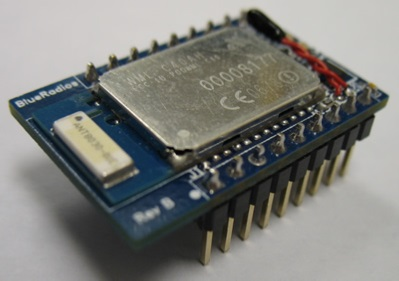
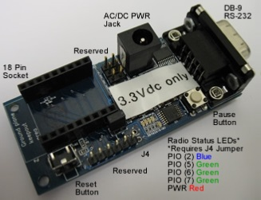
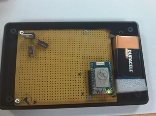
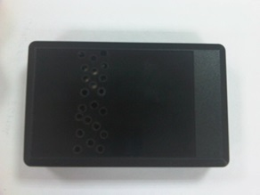

# 2.1. 2010 - Punto de partida

## 2.1.1. Problema existente

El proyecto surge de la necesidad de algunos transportistas de productos refrigerados por encontrar una solución para la correcta gestión en tiempo real de la cadena de frio de los productos que cargan.

La *cadena de frío* está formada por todos aquellos procesos que involucran a la temperatura del producto. Una cadena de frío que se mantiene intacta garantiza a un consumidor que el producto de consumo que recibe, se ha mantenido durante la producción, transporte, almacenamiento y venta dentro de un rango de temperaturas adecuado.

Para garantizar la cadena de frio, los sistemas actuales cuentan con tecnología embarcada en los camiones refrigerados que sólo dispone de información durante la carga y la descarga de la mercancía, no permitiendo el control de la temperatura en tiempo real durante la ruta. Además, dependiendo del fabricante del aparato refrigerador, la información que se obtiene tiene diferentes formatos, lo que dificulta su integración con software de terceros.

Todo este contexto produce los siguientes inconvenientes para la empresa de transportes:

1. Dificulta que el transportista pueda hacer la mejor elección de cara a la compra de nuevos vehículos, obligándole a comprar siempre los dispositivos de la misma marca para agilizar los procesos productivos de la empresa.
2. Si durante el transporte de la mercancía se rompe la cadena de frio, la mercancía en destino deberá ser eliminada, y se producirán retrasos en toda la cadena de suministro.
3. Al ser el sistema tan dependiente del fabricante, se dificulta la posibilidad de subcontratar el servicio a terceros, haciendo muy difícil la viabilidad económica del proyecto empresarial.

## 2.1.2. Solución planteada

Habiendo visto los problemas de los transportistas, la solución que se plantea debería contar con las siguientes características:

1. Sistema de terceros, no dependiente del fabricante
2. Fácil de instalar y de cambiar de vehículo, sistema versátil.
3. Barata, todos sabemos los momentos en los que nos encontramos, así que la solución deberá de tener un coste razonable
4. Fácilmente integrable en cualquier sistema de gestión

## 2.1.3. Primer prototipo

Por todo ello se decide crear un prototipo de solución para usar en un programa piloto con algunos transportistas.

El prototipo está formado por dos partes:

1. Aplicación para smartphone
2. Termógrafo inalámbrico

### Aplicación para smartphone

El mercado de smartphone en 2010 reflejaba una realidad totalmente distinta a la actual. En aquellos momentos la puesta en marcha de estos dispositivos estaba en sus primeros momentos y pocas personas disponían de terminales de los llamados *inteligentes*. Por aquel entonces, tanto *iPhone* como *Android* estaban avanzando en número de usuarios, pero los terminales de estas características más usados eran aún las *BlackBerry*, muy asentados además en el mercado empresarial. Es por ello que se decide apostar por esta plataforma para el primer prototipo.

Como queríamos buscar una solución sin cables, buscamos que protocolos de comunicación inalámbrica incluían los dispositivos *BlackBerry*. Entre los protocolos que soportaban aquellos terminales lo que nos pareció más conveniente fue usar comunicaciones puerto serie a través de *Bluetooth*. Así que comenzamos la búsqueda de sensores de temperatura que cumplieran dicha característica.

### Termógrafo inalámbrico

Se realizó una búsqueda de los diferentes proveedores de sistemas de control de temperatura con chips Bluetooth. El mejor que se encontró de todos ellos se trataba de un dispositivo que fabricaba *BlueRadios* formado por un chip Bluetooth, un sensor de temperatura y un pequeño microcontrolador. El dispositivo es el *"Mega BlueStamp® Wireless Temperature Module"* tal y como se observa en la Figura 2.1.1.

###### *Figura 2.1.1: Chip BlueRadios Mega BlueStamp*

Para poder realizar las correspondientes pruebas de funcionamiento también tuvimos que adquirir la placa de desarrollo, que cuenta con el socket donde poner el microcontrolador y un conector serie para poder configurar el dispositivo usando comandos AT y así como poder consultar la temperatura para poder comprobar que funcionaba.

###### *Figura 3: Placa desarrollo BlueRadios Mega BlueStamp*

Con este dispositivo realizamos las primeras pruebas conectándose al dispositivo desde el ordenador usando los comandos AT a través del puerto serie, resultando todas ellas satisfactorias.

Una vez visto que el sistema de control de temperatura funcionaba bien, montamos una caja con el modulo dentro y varios componentes eléctricos para convertirlo en un dispositivo autónomo. Esto era necesario porque la unidad está pensada para ser instalada en un vehículo de transporte frigorífico y necesitábamos hacer pruebas de comunicación a diferentes distancias, ya que el smartphone que controla el sensor iría embarcado en la cabina del camión y el sensor de temperatura iría embarcado en el remolque junto con la mercancía. Se incluyen a continuación algunas imágenes del dispositivo una vez montado y ensamblado:

###### *Figura 4: Interior prototipo sensor Bluetooth*

El sistema cuenta con un regulador de tensión, un par de condensadores y una pila de 9V. Además le acoplamos a la placa un socket para facilitar el ensamblaje del chip.

Durante las primeras pruebas vimos que el regulador de tensión que habíamos comprado se calentaba mucho y provocaba desviaciones en la temperatura captada por la sonda de temperatura, así que hicimos unos agujeros en la caja y sacamos la sonda por ellos para que no afectara la temperatura dentro de la caja. Este es el resultado final:

###### *Figura 5: Exterior prototipo sensor Bluetooth*

Tras la fabricación manual de la primera unidad completa comenzamos con el proceso de pruebas del dispositivo.

Dado que no contábamos con una infraestructura ideal para hacer las pruebas, intentamos conformar una que fuera lo más parecida posible. Para ello usamos el congelador de un frigorífico e hicimos las pruebas desde el exterior del edificio de trabajo. Dejamos el dispositivo que habíamos montado y con el dispositivo móvil y la aplicación que habíamos construido empezamos las pruebas con los siguientes resultados:

1.	La distancia máxima de funcionamiento era de 20 metros.
2.	El tiempo máximo de funcionamiento a -20º C de un pila alcalina Marca Duracell era de 2 horas.
3.	A temperatura ambiente el tiempo máximo de funcionamiento era de 3 días, usando la misma pila.

## Conclusiones
Aunque la solución montada funcionalmente era correcta, tenía varios problemas:

1.	La duración de la batería era de muy poco tiempo. Estuvimos viendo otras baterías de uso más profesional con mayor carga y  que funcionaran a bajas temperatura, pero descubrimos que el problema no era de la batería sino del protocolo Bluetooth, que en su versión 2.0 dejaba el canal de comunicación abierto durante todo el tiempo, mandando continuamente mensajes de control para comprobar que los dos dispositivos se encontraban siempre correctamente conectados (vinculados).
2.	La caja que habíamos montado no era resistente al agua, al tener que abrir agujeros para alojar la sonda. Este problema era salvable cambiando la caja y alojando la sonda fuera de la caja y sellando la salida para que entrara polvo ni agua.

