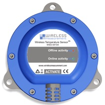
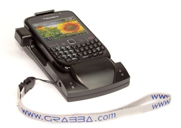
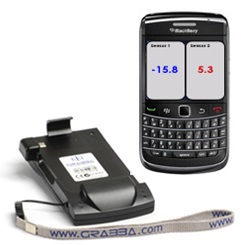
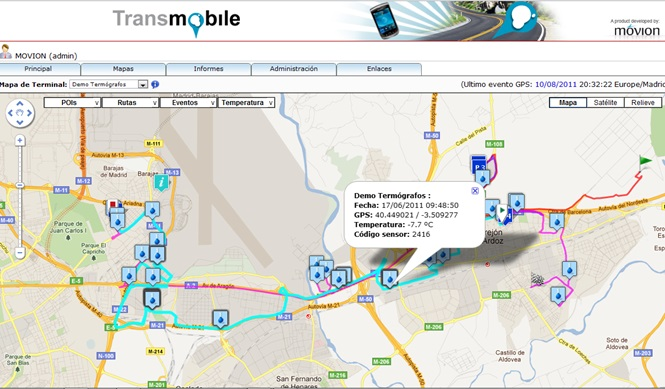

# 2.2. 2011 - Segundo intento

Una vez vistos los problemas que tuvimos con las pruebas realizadas con el primer prototipo empezamos a estudiar otras soluciones tecnológicas que nos permitieran realizar el control de la temperatura. Nuestro principal problema era el alto consumo de energía que conllevaba el uso de *Bluetooth 2.0*, así que nos encaminamos en la búsqueda de alternativas y así fue cuando conocimos el protocolo *ZigBee.*

## 2.2.1. Descubriendo ZigBee

>>***ZigBee*** es el nombre de la especificación de un conjunto de protocolos de alto nivel de comunicación inalámbrica para su utilización con radiodifusión digital de bajo consumo, basada en el estándar IEEE 802.15.4 de redes inalámbricas de área personal. Su objetivo son las aplicaciones que requieren comunicaciones seguras con baja tasa de envío de datos y maximización de la vida útil de sus baterías.

Era exactamente lo que estábamos buscando. Las principales ventajas de este protocolo con respecto a *Bluetooth* tradicional son las siguientes:

- Su bajo consumo.
- Su topología de red en malla, que permite que los nodos se comuniquen entre si.
- Su fácil integración, ya que requiere muy poca electrónica.

## 2.2.2. Segundo prototipo

Al igual que hicimos cuando empezamos a preparar el prototipo con *Bluetooth*, hicimos una búsqueda de marcos de desarrollo, chips y todo aquella información que nos pudiera ser de valor para montar este segundo prototipo, pero esta vez, con la diferencia de que encontramos un fabricante que tenía a la venta el dispositivo listo con todos los requerimientos que buscábamos:

1.	Resistente al polvo y al agua (grado de protección IP67)
2.	Batería de larga duración

El dispositivo era el *BluBug WML-WSO-04104*. En la Figura 2.2.1 se puede ver la imagen del dispositivo.

###### *Figura 2.2.1: Sensor de temperatura ZigBee BluBug*

En este caso, el principal reto era buscar la manera de obtener la información del sensor de temperatura usando el protocolo *ZigBee* con un dispositivo de uso comercial. Para ello se contactó con *BlackBerry* y nos recomendaron que trabajáramos con *Grabba*, un fabricante australiano que contaba con amplia experiencia en el desarrollo de tecnología móvil con *ZigBee*.

El fabricante contaba con una base *ZigBee* que se conectaba a un terminal *BlackBerry Curve 9300* tal y como se aprecia en la Figura 2.1.2. Nos pusimos en contacto con ellos y nos proporcionaron un par de unidades para poder comenzar con el desarrollo.

###### *Figura 2.1.2: Base Grabba para BlackBerry que añade conectividad ZigBee*

### Aplicación móvil

Se realizó una aplicación móvil para *BlackBerry* que incluía las siguientes características:

- Asociación del terminal con un sensor de temperatura.
- Visualización de los datos del sensor desde el propio dispositivo
- Envío de temperaturas a una plataforma web propia para poder analizar y monitorizar la información de los sensores de forma remota.

###### *Figura 2.1.3: Aplicación móvil desarrollada*

### Construcción de plataforma web

Para poder monitorizar los datos de temperatura se crearon servicios web en *Transmobile*, nuestra plataforma de gestión de rutas de terminales por geoposicionamiento. Esta permitía además:

- Gestionar los terminales 
- Crear informes con la información que enviavan los mismos
- Visualización de rutas geoposicionadas

###### *Figura 4: Plataforma web desarrollada *

### Prueba piloto

Una vez creado el primer prototipo de aplicación móvil se contactó con algunos clientes que disponían camiones refrigerados para ofrecerles probar esta nueva solución y evaluar la aceptación de la misma.

Este segundo intento, aun siendo aún muy mejorable, tuvo muy buena aceptación y los clientes que participaron en el programa piloto fueron demandando que incluyeramos más funcionalidad.

