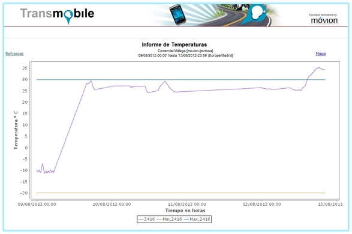

# 2.3. 2012 - Puesta en marcha

Como en los clientes que utilizaron la aplicación tuvo cierta aceptación nos animamos a incluir nueva funcionalidad en la aplicación para que fuera una solución más completa. Entre las mejoras que incluimos estaban las siguientes:

- **Mejoras de aplicación BlackBerry**:
    - Pareado con varios sensores a la vez
	- Carga de configuración y licencia desde servicios web
	- Mejora de la visualización de la temperatura visible
	- Añadidas alertas de umbrales críticos de temperatura
	 
	
- ** Mejoras en la plataforma web Transmobile **
	- Configuración y gestión de sensores
	- Agregación de nuevos informes de temperaturas
	- Mejora en la visualización de los mapas

###### *Figura 1: Informe de temperaturas.*

Debido a las nuevas mejoras tanto de la aplicación móvil como de la web de Transmobile se consiguen atraer a nuevos clientes que comienzan a utilizar nuestra solución de control y monitorización de temperaturas.

Es a finales de este año cuando se decide presentar la presente solución como proyecto de fin de carrera con el fin de seguir aplicándole mejoras al proyecto y avanzar en el desarrollo del mismo.
