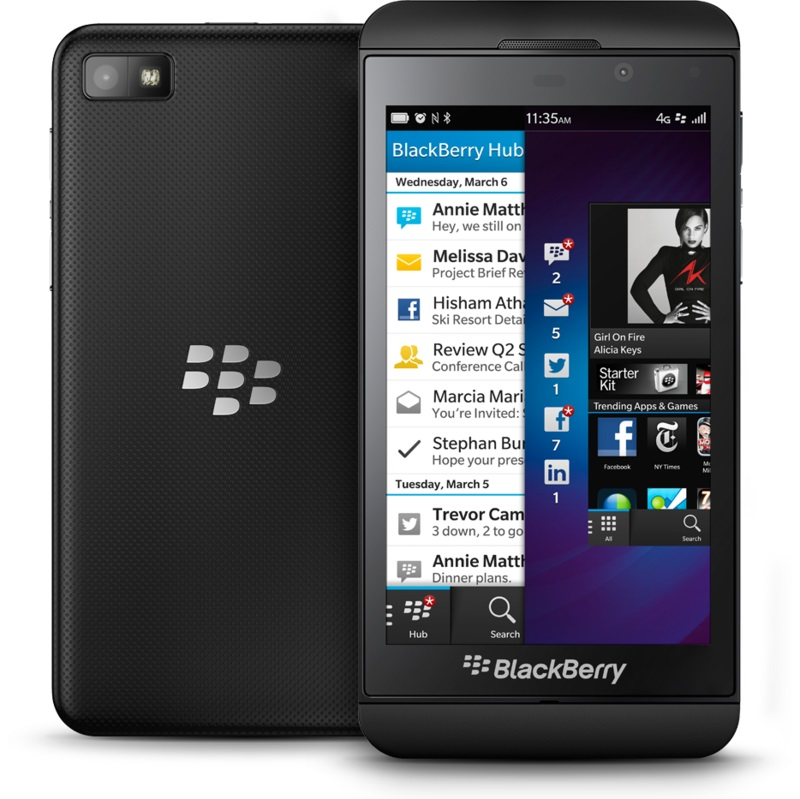

# 2.4. 2013 - Giro inesperado

A principios de 2013 una noticia hace que el futuro planteado para este proyecto cambie de forma drástica. **BlackBerry anuncia que cambia de plataforma y no habrá retrocompatibilidad** con las aplicaciones Java desarrolladas hasta ahora.

## 2.4.1. Nacimiento de BlackBerry 10

Éste es el nombre del nuevo sistema operativo que incluirán los terminales **BlackBerry**. Blackberry 10 está basado en QNX que fue adquirido por *RIM* en abril de 2010. 

- Sistema operativo **multitarea** 
- Preparado para **tareas en tiempo real** ya que implementa **POSIX**
- Entorno de programación nativo en **C++**
- Frameworks de desarrollo **Qt/Cascades**
- Soporte de **Bluetooth 4.0 Low Energy**
- **Sin compatibilidad con aplicaciones J2ME**

A mediados de este año aparece el **primer terminal BlackBerry 10 en el mercado**, la *BlackBerry Z10* y se anuncia que dejará de dar soporte para el antiguo sistema BlackBerry 7 que permitía ejecutar aplicaciones basadas en J2ME.

###### *Figura 1: Primer terminal BlackBerry 10 *

## 2.4.2. Interrupción en el desarrollo 

Debido a la incertidumbre que provoca este cambio en la política de BlackBerry en la cual habíamos basado nuestra actual aplicación de monitorización de temperaturas se decide parar el desarrollo a la espera de conocer mejor esta nueva plataforma. 

Aún así se decide seguir apostando por BlackBerry para el desarrollo de otras aplicaciones más sencillas con el fin de investigar las posibilidades que puede dar esta nueva versión del sistema operativo.
