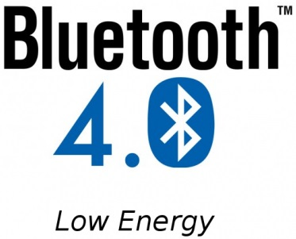

# 2014 - Un nuevo comienzo

## Cuota de mercado

En 2014 se dan unas circunstancias en el mercado de los smartphones que nos hacen replantearnos sobre qué plataforma haremos la investigación para la nueva aplicación de monitorización de temperatura:

- **Baja mucho la cuota de mercado para BlackBerry**.
- **El mercado Android copa el mercado de consumo** y cada vez es más incipiente en el ámbito empresarial, aunque BlackBerry sigue siendo referencia en este nicho de mercado.
- **Los fabricantes de dispositivos hardware sacan SDKs sólo para Android y iPhone**, aunque los ejemplos en la documentación de BlackBerry 10 para la integración con otros dispositivos son amplios.

| Año   | Android |   iOS  | Symbian | BlackBerry | Windows Phone |
| ----- | ------- | ------ | ------- | ---------- | ------------- |
| 2015  |  78.00% | 18.30% |   0.00% |      0.30% |         2.70% |
| 2014  |  81.20% | 15.20% |   0.00% |      0.50% |         2.50% |
| 2013  |  74.98% | 17.30% |   0.56% |      2.91% |         3.24% |
| 2012  |  59.03% | 23.05% |   6.83% |      6.37% |         2.17% |
| 2011  |  36.12% | 18.31% |  25.98% |     13.58% |         2.56% |

###### *Tabla 1: Porcentaje de ventas mundiales de smartphones (Datos de IDC)*

## Bluetooth 4.0 Low Energy

En 2014 comienza a tomar fuerza la nueva versión de Bluetooth que introduce mejoras para el ahorro de energía. Este protocolo denominado **Bluetooth LE** y **Bluetooth Smart**, es una nueva tecnología comunicación inalámbrica para la interoperabilidad con pequeños dispositivos.

Las **ventajas** de este nuevo estandar Bluetoth con respecto a sus anteriores versiones es:

- Consumo de energía en modo inactivo ultra bajo
- Capacidad de durabilidad en las baterías de tipo botón durante años 
- Menor coste de implementación
- Interoperabilidad entre múltiples proveedores
- Rango de alcance mejorado

Además, las últimas versiones de todos sistemas operativos para smartphones (iOS, Android, Windows Phone and BlackBerry) ya soportan este protocolo de comunicación y los nuevos terminales móviles ya suelen traer el hardware apropiado para hacerlo funcionar.

###### *Figura 2: Logotipo de Bluetooth 4.0 *

## Conclusiones

Todos estos nuevos acontecimientos hacen replantearnos el comenzar una nueva investigación y un nuevo proyecto. En el siguiente capítulo veremos cuales son las alternativas disponibles y el por qué de la elección las tecnologías que vamos a emplear.