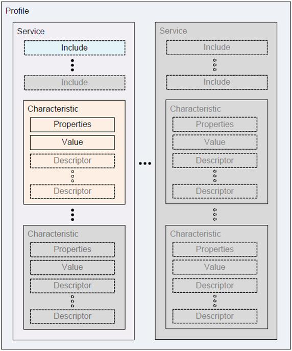
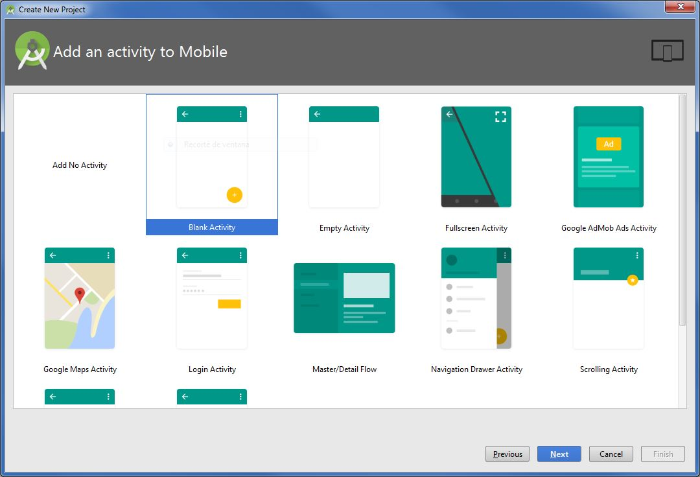
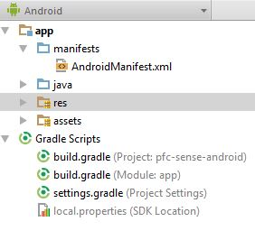
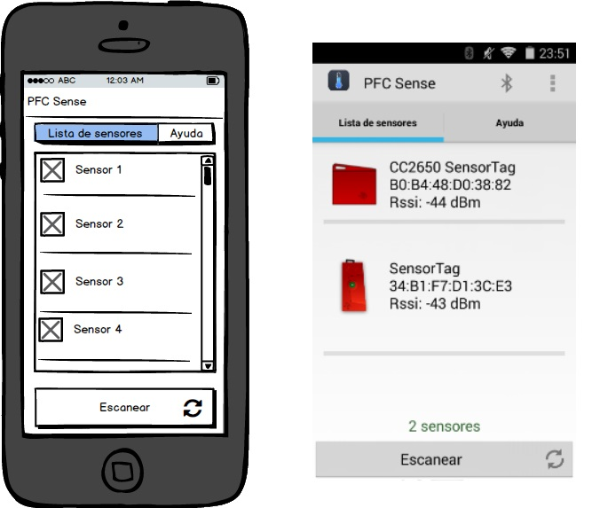

# 5.3. Iteracion 1: Consultar listado de sensores

En esta primera iteración nos hemos propuesto poder consultar desde la aplicación móvil qué sensores hay disponibles para conectarse. Para ello, antes que nada será necesario estudiar cuales son las principales caracteristicas del protocolo Bluetooth LE para posteriormente crear una aplicación y configurarla para que permita escanear los sensores disponibles. Además, deberemos crear una interfaz acorde con el diseño de la UI analizada en el Capitulo 5. El desglose de las tareas que vamos a realizar podemos observarla en la Tabla 5.3.1.

| Tarea | Descripción |
| -- | -- |
| 1.1 | Estudio del protocolo Bluetooth LE |
| 1.2 | Creación de proyecto para la aplicación en Android Studio |
| 1.3 | Configuración del proyecto para utilizar Bluetooth LE |
| 1.4 | Crear controlador para detectar dispositivos Bluetooth disponibles |
| 1.5 | Generar la interfaz del listado de dispositivos |
##### *Tabla 5.3.1: Tareas de la iteración 1* 


## 5.3.1. Estudio del protocolo Bluetooth LE

Al contrario que ocurría con el Bluetooth clásico, Bluetooth Low Energy está diseñado para proporcionar un significante bajo consumo energético. Android da soporte a este protocolo desde su versión 4.3, esto le permite comunicarse con sensores, monitores de ritmo cardiaco, dispositivos deportivos y muchos más. Algunos de los conceptos que hay que conocer sobre Bluetooth LE (BLE) son:

- **Generic Attribute Profile (GATT)**: el perfil GATT es una especificación general para el envío y la recepción de pequeñas piezas de datos también conocidas como "atributos" a través de una conexión BLE. Actualmente, todos los perfiles de comunicación actuales están basados en GATT. El consorcio Bluetooth tiene definidos multitud de perfiles GATT para diversos propósitos. Hay que tener en cuenta que un mismo dispositivo puede implementar varios de estos perfiles, algunos ejemplos de perfiles GATT son:
   - BAS: Nivel de batería del dispositivo
   - BLP: Consulta de presión sanguínea
   - CGMP: Control de glucosa en sangre
   - CSCP: Cadencia y velocidad en ciclismo
   - ESP: Sensor ambiental 
   - HRP: Consulta de ritmo cardiaco
    

- **Attribute Protocol (ATT)**:  También conocido como GATT/ATT. Se trata de los paquetes de comunicación usados en las comunicaciones BLE y están optimizados para usar el menor número de bytes posibles. Cada atributo está identificado de forma única por un Universally Unique Identifier (UUID) que está estandarizado en un formato de 128 bits. Los *atributos* transportados por ATT están formateados como *características* y *servicios*.

- **Característica**: una característica contiene un valor y además, opcionalmente, puede contener descriptores que describan el valor de la característica. Hay que pensar en una característica como un tipo o clase.

- **Descriptor**: Los descriptores son atributos que describen el valor de una característica. Por ejemplo, un descriptor puede contener una cadena descriptiva, el rango de aceptación de un valor, o la unidad de medida del valor que contiene la característica.

- **Servicio**: Un servicio es una colección de características. Por ejemplo, el servicio "Heart Rate Monitor" incluye características como "heart rate measurement", además de otras.

Resumiendo, podemos decir que un dispositivo Bluetooth LE puede implementar uno o varios perfiles GATT que a su vez este puede implementar uno o varios servicios, donde cada servicio puede contener una o varias características y que estas caracteristicas además de su valor puede contener ninguno o varios descriptores. Todo esto queda más claro si se observa mejor el esquema de la Figura 5.3.1.


##### *Figura 5.3.1: Esquema de un perfil GATT* 


## 5.3.2. Creación de proyecto para la aplicación en Android Studio

Crear un proyecto con Android Studio no es ningún misterio. Dispone de asistentes de configuración muy intuitivos para la creación de nuevos proyecto, nosotros eligiremos el proyecto con una *Activity* en blanco como se puede observar en la Figura 5.3.2


##### *Figura 5.3.2: Asistente de creación de proyecto en Android Studio* 

La estructura de un proyecto Android es muy sencilla como puede observarse en la Figura 5.3.3. Explicaremos brevemente sus partes más destacadas:

- **AndroidManifest.xml**: Es el fichero donde se especifica las características generales de una aplicación Android típica, como su nombre, su número de versión, la versión del SDK que utiliza, los permisos que necesita y las *Activitys* y los *Services* que lo componen.
- **java**: En esta carpeta se incluye todo el código de la aplicación, aquí se encuentran las clases del modelo, los controladores y las *Activitys*, los *Fragments* y los *Services* que vamos a utilizar en la aplicación.
- **res**: En esta carpeta se encuentran los recursos, tales como los layouts de las interfaces gráficas, las imágenes, los archivos de traducciones, etc
- **assets**: Aquí se encuentran el resto de ficheros que puedan necesitarse para la aplicación, tales como páginas html para cargar la ayuda, o ficheros de bases de datos.


##### *Figura 5.3.3: Estructura de proyecto Android*

Por ultimo nos quedaría configurar un repositorio Git para nuestro control de versiones, para ello hacemos uso de la herramienta de escritorio SourceTree con la que crearemos nuestro repositorio local. Además, para poder tener una copia de seguridad y poder descargarnos el código y poder trabajar desde otro equipo crearemos un repositorio en BitBucket con el cual nos sincronizaremos.


## 5.3.3. Configuración del proyecto para utilizar Bluetooth LE


### Configuración de permisos
Según la documentación de Android, para utilizar las funcionalidad de Bluetooth LE es necesario declarar en nuestro archivo *manifest* una serie de permisos y *features*, lo mostramos en el Código 5.3.1 que vemos a continuación:

```
<uses-permission android:name="android.permission.BLUETOOTH"/>
<uses-permission android:name="android.permission.BLUETOOTH_ADMIN"/>

<uses-feature android:name="android.hardware.bluetooth_le" android:required="true"/>
```
##### *Código 5.3.1: Permisos y features necesarias en AndroidManifest.xml*

Estos permisos nos permitirán interaccionar con dispositivos Bluetooth y poder configurar el teléfono para el emparejamiento con los diferentes sensores.


### Configuración en controlador de la aplicación
El siguiente paso será añadir en nuestra *Activity* principal un manejador que consulte si nuestro terminal dispone de conectividad Bluetooth LE y en caso contrario se salga de la aplicación. Para ello añadiremos las siguientes lineas que vemos en Código 5.3.2.

```
// Use this check to determine whether BLE is supported on the device. Then
// you can selectively disable BLE-related features.
if (!getPackageManager().hasSystemFeature(PackageManager.FEATURE_BLUETOOTH_LE)) {
    Toast.makeText(this, R.string.ble_not_supported, Toast.LENGTH_SHORT).show();
    finish();
}
```
##### *Código 5.3.2: Control de soporte Bluetooth en MainActivity.java*

Una vez que nos hemos cerciorado de que nuestro teléfono tiene conectividad Bluetooth LE añadiremos otra porción de código que se encargue de activar el Bluetooth por nosotros si este estaba deshabilitado, para ello haremos uso de la clase ```BluetoothAdapter``` de la API de Android. El proceso se hace en dos pasos:

1. Recuperar el ```BluetoothAdapter```
```
// Initializes Bluetooth adapter.
final BluetoothManager bluetoothManager =
        (BluetoothManager) getSystemService(Context.BLUETOOTH_SERVICE);
mBluetoothAdapter = bluetoothManager.getAdapter();
```
2. Habilitar la conectividad Bluetooth
```
private BluetoothAdapter mBluetoothAdapter;
...
// Ensures Bluetooth is available on the device and it is enabled. If not,
// displays a dialog requesting user permission to enable Bluetooth.
if (mBluetoothAdapter == null || !mBluetoothAdapter.isEnabled()) {
    Intent enableBtIntent = new Intent(BluetoothAdapter.ACTION_REQUEST_ENABLE);
    startActivityForResult(enableBtIntent, REQUEST_ENABLE_BT);
}
```

## 5.3.4. Crear controlador para detectar dispositivos Bluetooth disponibles

Configurada la aplicación con Bluetooth ya tenemos todo dispuesto para comenzar a recuperar el listado de los sensores disponibles. Para recupear los dispositivos disponibles crearemos un método ```startLeScan()``` que tomará como parámetro un objeto de la clase ```BluetoothAdapter.LeScanCallback```. Más adelante, la vista que se encargue de listar los sensores deberá implementar dicha interfaz. 

Debido a que el escaneo de dispositivos es un procedimiento que drena bastante la batería del teléfono, tendremos en cuenta una serie de consideraciones que recomienda la documentación de Android:

- Tan pronto como encontremos el dispositivo que buscamos, pararemos el escaneo.
- No realizar un blucle de escaneo y añadir un tiempo límite a la busqueda.
 

El siguiente trozo de código muestra como arrancar y parar el proceso de escaneo:

```
/**
 * Activity for scanning and displaying available BLE devices.
 */
public class DeviceScanActivity extends ListActivity {

    private BluetoothAdapter mBluetoothAdapter;
    private boolean mScanning;
    private Handler mHandler;

    // Stops scanning after 10 seconds.
    private static final long SCAN_PERIOD = 10000;
    ...
    private void scanLeDevice(final boolean enable) {
        if (enable) {
            // Stops scanning after a pre-defined scan period.
            mHandler.postDelayed(new Runnable() {
                @Override
                public void run() {
                    mScanning = false;
                    mBluetoothAdapter.stopLeScan(mLeScanCallback);
                }
            }, SCAN_PERIOD);

            mScanning = true;
            mBluetoothAdapter.startLeScan(mLeScanCallback);
        } else {
            mScanning = false;
            mBluetoothAdapter.stopLeScan(mLeScanCallback);
        }
        ...
    }
...
}
```

Este método será el que se invoque cada vez que pulsemos a nuestro botón 'Escanear'. Ya sólo nos quedaría implementar el *callback* que añadirá los sensores a nuestra clase ```DeviceListAdapter``` que es la encargada de listar los sensores en la pantalla. El código que tendremos que añadir es el siguiente:

```
private DeviceListAdapter mDeviceAdapter;
...
// Device scan callback.
private BluetoothAdapter.LeScanCallback mLeScanCallback =
        new BluetoothAdapter.LeScanCallback() {
    @Override
    public void onLeScan(final BluetoothDevice device, int rssi,
            byte[] scanRecord) {
        runOnUiThread(new Runnable() {
           @Override
           public void run() {
               mDeviceAdapter.addDevice(device);
               mDeviceAdapter.notifyDataSetChanged();
           }
       });
   }
};
```

## 5.3.5. Generar la interfaz del listado de dispositivos

No vamos a explicar en profundidad el proceso de la composición de la UI ya que no consideramos que sea muy relevante para la investigación del proyecto. Sólo comentaremos que intentamos ceñirnos lo más que pudimos al diseño propuesto en el Capítulo 4, el resultado lo podemos apreciar en la Figura 5.3.4


##### *Figura 5.3.4: Comparación diseño del listado con UI final*