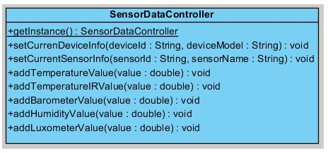

# 5.4. Iteración 2: Monitorizar los valores de las temperaturas in situ

Ya conseguimos listar los sensores disponibles, el siguiente paso será conectarnos con uno de ellos, recuperar sus perfiles GATT, filtrar los que no son necesarios para monitorizar la temperatura y crear una interfaz atractiva que muestre los valores actuales y una gráfica con las últimas temperaturas enviadas para poder visualizar de un vistazo si han ocurrido cambios en la misma. El desglose de las tareas que vamos a realizar podemos observarla en la Tabla 5.4.1.

| Tarea | Descripción |
| -- | -- |
| 2.1 | Conectar con un sensor y recuperar sus perfiles GATT |
| 2.2 | Filtrar los perfiles GATT que nos interesan y extraer sus valores |
| 2.3 | Crear controlador para añadir los valores de los sensores |
| 2.4 | UI que muestre los valores actuales y las gráficas |
##### *Tabla 5.4.1: Tareas de la iteración 2* 


## 5.4.1. Conectar con un sensor y recuperar sus perfiles GATT

El primer paso en la interacción con un dispositivo BLE es conectarnos a él, aunque, más específicamente, conectarnos al servidor GATT de el dispositivo. Para ello tendremos que hacer uso del método ```connectGatt()``` que vemos en Código 5.4.1.

```java
mBluetoothGatt = device.connectGatt(this, false, mGattCallback);
```
##### *Código 5.4.1: Implementación inicial de BluetoothLeService.java*

Al conectarnos al servidor GATT nos devuelve una instancia de un objeto ```BluetoothGatt``` con el cual podremos hacer uso y conectarnos como cliente. El parámetro de tipo ```BluetoothGattCallback``` es usado para recuperar resultados por parte del cliente, como son el estado de la conexión así como más operaciones GATT de los clientes.

Para hacer la implementación crearemos un ```Service``` llamado ```BluetoothLeService``` que interactuará con nuestra ```Activity```. El servicio tendrá la siguiente forma que se ve en Código 5.4.2.

```java
// A service that interacts with the BLE device via the Android BLE API.
public class BluetoothLeService extends Service {
    private final static String TAG = BluetoothLeService.class.getSimpleName();

    private BluetoothManager mBluetoothManager;
    private BluetoothAdapter mBluetoothAdapter;
    private String mBluetoothDeviceAddress;
    private BluetoothGatt mBluetoothGatt;
    private int mConnectionState = STATE_DISCONNECTED;

    private static final int STATE_DISCONNECTED = 0;
    private static final int STATE_CONNECTING = 1;
    private static final int STATE_CONNECTED = 2;

    public final static String ACTION_GATT_CONNECTED =
            "com.celulabs.pfcsense.ble.common.ACTION_GATT_CONNECTED";
    public final static String ACTION_GATT_DISCONNECTED =
            "com.celulabs.pfcsense.ble.common.ACTION_GATT_DISCONNECTED";
    public final static String ACTION_GATT_SERVICES_DISCOVERED =
            "com.celulabs.pfcsense.ble.common.ACTION_GATT_SERVICES_DISCOVERED";
    public final static String ACTION_DATA_NOTIFY =
            "com.celulabs.pfcsense.ble.common.ACTION_DATA_NOTIFY";
    public final static String EXTRA_DATA = 
            "com.celulabs.pfcsense.ble.common.EXTRA_DATA";
    public final static String EXTRA_UUID = 
            "com.celulabs.pfcsense.ble.common.EXTRA_UUID";
    public final static String EXTRA_STATUS = 
            "com.celulabs.pfcsense.ble.common.EXTRA_STATUS";
    public final static String EXTRA_ADDRESS = 
            "com.celulabs.pfcsense.ble.common.EXTRA_ADDRESS";
    
    // Various callback methods defined by the BLE API.
    private final BluetoothGattCallback mGattCallback =
            new BluetoothGattCallback() {
        @Override
        public void onConnectionStateChange(BluetoothGatt gatt, int status,
                int newState) {
            String intentAction;
            if (newState == BluetoothProfile.STATE_CONNECTED) {
                intentAction = ACTION_GATT_CONNECTED;
                mConnectionState = STATE_CONNECTED;
                broadcastUpdate(intentAction);
                Log.i(TAG, "Connected to GATT server.");
                Log.i(TAG, "Attempting to start service discovery:" +
                        mBluetoothGatt.discoverServices());

            } else if (newState == BluetoothProfile.STATE_DISCONNECTED) {
                intentAction = ACTION_GATT_DISCONNECTED;
                mConnectionState = STATE_DISCONNECTED;
                Log.i(TAG, "Disconnected from GATT server.");
                broadcastUpdate(intentAction);
            }
        }

        @Override
        // New services discovered
        public void onServicesDiscovered(BluetoothGatt gatt, int status) {
            if (status == BluetoothGatt.GATT_SUCCESS) {
                broadcastUpdate(ACTION_GATT_SERVICES_DISCOVERED);
            } else {
                Log.w(TAG, "onServicesDiscovered received: " + status);
            }
        }

        @Override
        // Result of a characteristic read operation
        public void onCharacteristicRead(BluetoothGatt gatt,
                BluetoothGattCharacteristic characteristic,
                int status) {
            if (status == BluetoothGatt.GATT_SUCCESS) {
                broadcastUpdate(ACTION_DATA_NOTIFY, characteristic);
            }
        }
     ...
    };
...
}
```
##### *Código 5.4.2: Implementación inicial de BluetoothLeService.java*

Cuando un determinado *callback* es accionado, este llama a su método apropiado ```broadcastUpdate()``` que lanza la acción que le determinemos. Por ejemplo, nosotros propagaremos las acciones de conexión y desconexión, cuando descubramos un nuevo servicio y cuando nos llegue el valor de una característica como vemos en el Código 5.4.3.

```java
private void broadcastUpdate(final String action, final String address,
    final int status) {
	final Intent intent = new Intent(action);
	intent.putExtra(EXTRA_ADDRESS, address);
	intent.putExtra(EXTRA_STATUS, status);
	sendBroadcast(intent);
}

private void broadcastUpdate(final String action,
    final BluetoothGattCharacteristic characteristic, final int status) {
	final Intent intent = new Intent(action);
	intent.putExtra(EXTRA_UUID, characteristic.getUuid().toString());
	intent.putExtra(EXTRA_DATA, characteristic.getValue());
	intent.putExtra(EXTRA_STATUS, status);
	sendBroadcast(intent);
}
```
##### *Código 5.4.3: Implementación de método broadcastUpdate() de BluetoothLeService.java*

## 5.4.2. Filtrar los perfiles GATT que nos interesan y extraer sus valores

Ya hemos conseguido conectarnos a un sensor y recuperar los valores de sus características, ahora nos quedaría recuperar esos valores y el tipo de característica enviada y quedarnos solo con la de aquellos perfiles GATT que nos interese. En nuestro caso los perfiles que nos interesan son:

- Temperatura ambiental
- Temperatura por infrarojos (IR)
- Barómetro
- Luxómetro
- Humedad

Para consultar los UUID de los servicios que nos interesan hemos consultado la documentación que nos ofrece Texas Instruments acerca de los perfiles GATT de su dispositivo Sensor Tag, podemos ver un ejemplo de la documentación para el sensor de temperatura en la Figura 5.4.1.


##### *Figura 5.4.1: UUIDs de los servicios GATT de Temperatura*

Para la gestión de los diferentes perfiles GATT crearemos una clase para controlar cada uno de ellos que heredarán de una cláse genérica con métodos comunes llamada ```GenericBluetoothProfile```. El diseño de esta clase y de los controladores de cada perfil puede observarse en la Figura 5.4.2. En cada controlador de perfil gestionaremos si el valor de la característica leída se debe tratar en dicho controlador y si es así, como recuperar y manejar cada valor. 


##### *Figura 5.4.2: Diagrama de clases para los controladores de perfiles GATT*

En el Código 5.4.4 del controlador  ```SensorTagAmbientTemperatureProfile``` vemos como consultar que se trata del perfil correcto y cómo extraer el valor de su característica:

```java
public static boolean isCorrectService(BluetoothGattService service) {
	if ((service.getUuid().toString().compareTo(SensorTagGatt.UUID_IRT_SERV.toString())) == 0) {
		return true;
	} else {
	    return false;
	}    
}

@Override
public void didUpdateValueForCharacteristic(BluetoothGattCharacteristic c) {
    byte[] value = c.getValue();
	if (c.equals(this.dataC)){
		Point3D v = Sensor.IR_TEMPERATURE.convert(value);
        double temperatureValue = v.x;

		if (this.tRow.config == false) { 
			if ((this.isEnabledByPrefs("imperial")) == true)      
			    this.tRow.value.setText(String.format("%.1f'F", (temperatureValue * 1.8) + 32));
			else 
			    this.tRow.value.setText(String.format("%.1f'C", temperatureValue));
		}
		this.tRow.sl1.addValue((float)temperatureValue);

		SensorDataController.getInstance().addTemperatureValue(temperatureValue);
	}
}
```
##### *Código 5.4.3: Actualización de temperatura en SensorTagAmbientTemperatureProfile.java*

## 5.4.3. Crear controlador para añadir los valores de los sensores

Para la gestión interna de nuestros datos de sensores, sería conveniente controlar cierta información de los sensores con los que estamos conectados. Para ello implementaremos los modelos que ya analizamos en el Capítulo 4, por un lado implementaremos los modelos para guardar la información de nuestro smartphone y del sensor actual con el que estamos conectados, el diseño para las clases ```DeviceInfo``` y ```SensorInfo``` lo podemos apreciar en la Figura 5.4.3.


##### *Figura 5.4.3: Diagrama de clases para el modelo de DeviceInfo y SensorInfo*

Además, nos hará falta los modelos para los valores de los diferentes sensores vayan recuperando, para ello implementaremos la clase ```SensorData``` genérica de la que heredaran los datos de los diferentes servicios GATT a los que nos conectaremos. El diseño de dichos modelos los podemos observar en la Figura 5.4.4.


##### *Figura 5.4.4: Diagrama de clases para los valores SensorData*

Una vez implementados los módelos, el siguiente paso será implementar el controlador con el cual gestionemos el uso de los diferentes datos en la aplicación. Crearemos por tanto la clase SensorDataController que  podemos observar en la Figura 5.4.5. Por ahora nos servirá para consultar los valores actuales, pero más adelante será la que modifiquemos para persistir los valores, almacenarlos en servidor y comunicarnos con nuestro dashboard de monitorización remota.  

##### *Figura 5.4.5: Diagrama del controlador SensorDataController*


## 5.4.4. UI que muestre los valores actuales y las gráficas

Para la visualización de los datos de temperatura, la humedad relativa, la presión atmosférica y la luminosidad ambiental nos fijaremos en el diseño que analizamos en el Capítulo 4. Este nos servirá de referencia para la creación de la interfaz de usuario.

Para la conexión y recuperación de los diferentes perfiles GATT activos en la aplicación mostraremos un dialogo con el progreso en la recuperación de los mismos como se aprecia en la Figura 5.4.6.


##### *Figura 5.4.6: Recuperación de características del sensor*

Finalmente, en la Figura 5.4.7 podemos observar la diferencia de entre el diseño inicial de la interfaz de monitorización de temperaturas y como realmente se ha implementado.


##### *Figura 5.4.7: Comparación diseño del monitorizado de sensores con UI final*


