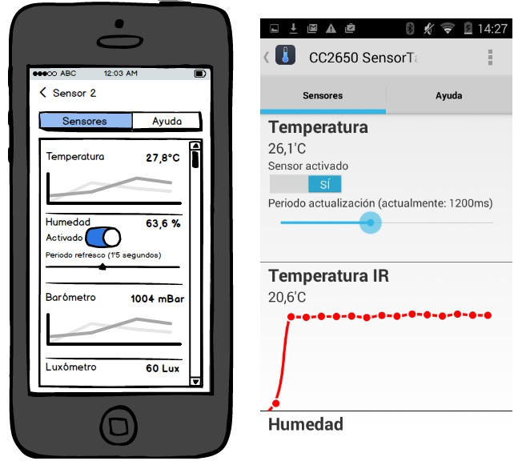

# 5.5. Iteración 3: Configurar sensores

Ya que hemos conseguido monitorizar los sensores, el siguiente paso sería poder configurarlos convenientemente, los sensores disponen de servicios para habilitar/deshabilitar un sensor en particular además de para configurar el periodo en el que se consultan los valores de los mismos. El poder configurar convenientemente estos sensores nos ayudará a ahorrar batería de los mismos para sólo hacer la consulta de aquellos que necesitemos y con la frecuencia que necesitemos. El desglose de las tareas para esta iteración se puede observar en la Tabla 5.5.1.

| Tarea | Descripción |
| -- | -- |
| 3.1 | Enviar configuración a los sensores |
| 3.2 | UI de configuración de sensores |
##### *Tabla 5.5.1: Tareas de la iteración 3* 


## 5.5.1 Enviar configuración a los sensores

Nuestra clase ```GenericBluetoothProfile``` de la que heredan todos nuestros perfiles GATT tiene varias carácterísticas, una es la de datos que usamos para recuperar los valores de los sensores, tiene una de configuración que es de lectura/escritura, donde podemos habilitar y deshabilitar el perfil, y una de periodo donde se puede escribir el valor de refresco del sensor que tiene asociado dicho perfil GATT. Para leer y escribir dichas características hemos implementado los métodos en ```BluetoothLeService``` que vemos en Código 5.5.1.

```java
public int readCharacteristic(BluetoothGattCharacteristic characteristic) {
        bleRequest req = new bleRequest();
        req.status = bleRequestStatus.not_queued;
        req.characteristic = characteristic;
        req.operation = bleRequestOperation.rdBlocking;
        addRequestToQueue(req);
        boolean finished = false;
        while (!finished) {
            bleRequestStatus stat = pollForStatusofRequest(req);
            if (stat == bleRequestStatus.done) {
                
                return 0;
            } else if (stat == bleRequestStatus.timeout) {
                return -3;
            }
        }
        return -2;
}

public int writeCharacteristic(
	    BluetoothGattCharacteristic characteristic, byte[] b) {
    characteristic.setValue(b);
    bleRequest req = new bleRequest();
    req.status = bleRequestStatus.not_queued;
    req.characteristic = characteristic;
    req.operation = bleRequestOperation.wrBlocking;
    addRequestToQueue(req);
    boolean finished = false;
    while (!finished) {
        bleRequestStatus stat = pollForStatusofRequest(req);
        if (stat == bleRequestStatus.done) {
            finished = true;
            return 0;
        } else if (stat == bleRequestStatus.timeout) {
            finished = true;
            return -3;
        }
    }
    return -2;
}
```
##### *Código 5.5.1: Lectura/Escritura de una característica en BluetoothLeService.java*

Ya teniendo implementados los métodos de lectura y escritura de las características de un perfil GATT, quedaría implementar los métodos de alto nivel en ```GenericBluetoothProfile``` para activar/desactivar notificación de los servicios como se ven en el Código 5.5.2.

```
public void enableService () {
    int error = mBTLeService.writeCharacteristic(this.configCharacteristic, (byte)0x01);
    if (error != 0) {
        if (this.configCharacteristic != null)
            printError("Sensor enable failed: ",this.configCharacteristic,error);
    }
    this.isEnabled = true;
}

public void disableService () {
    int error = mBTLeService.writeCharacteristic(this.configCharacteristic, (byte)0x00);
    if (error != 0) {
        if (this.configCharacteristic != null)
            printError("Sensor disable failed: ",this.configCharacteristic,error);
    }
    this.isConfigured = false;
}
```
##### *Código 5.5.2: Activación/Desactivación de un servicios en GenericBluetoothProfile.java*


## 5.5.2 UI de configuración de sensores

Cuando detectamos desde la UI que se cambian el periodo de los sensores invocamos a nuestro ```GenericBluetoothProfile```, que es la clase de la que heredan todos los controladores de los diferentes perfiles GATT, que a su vez llama a nuestro ```BluetoothLeService``` ya preparado con los métodos para habilitar/deshabilitar un determinado perfil GATT o cambiar su periodo. Como los umbrales que nos da el fabricantes de periodos de actualización varían entre los 100 ms y los 2450 ms, los usaremos como límites en nuestro slider de configuración. En el Código 5.5.3 se detallan los métodos implementados para invocar estas actualizaciones de configuración.

```
public void onOffWasUpdated(boolean on) {
	Log.d("GenericBluetoothProfile","Config characteristic set to :" + on);
	if (on) {
		this.configureService();
		this.enableService();
		this.tRow.grayedOut(false);
	}
	else {
		this.deConfigureService();
		this.disableService();
		this.tRow.grayedOut(true);
	}
	
}

public void periodWasUpdated(int period) {
	if (period > 2450) period = 2450; 
	if (period < 100) period = 100;
	byte p = (byte)((period / 10) + 10);
	Log.d("GenericBluetoothProfile","Period characteristic set to :" + period);
   
    int error = mBTLeService.writeCharacteristic(this.periodCharacteristic, p);
    if (error != 0) {
        if (this.periodC != null)
            printError("Sensor period failed: ", this.periodCharacteristic, error);
    }
    
	this.tRow.periodLegend.setText("Periodo actualización (actualmente : " + period + "ms)");
}
```
##### *Código 5.5.3: Métodos de configuración de servicios GATT en GenericBluetoothProfile.java*

En la Figura 5.5.1 podemos observar como quedaría la interfaz de configuración en comparación con el diseño propuesto en el Capítulo 4.


##### *Figura 5.5.1: Comparación de diseño con UI de configuración de sensores*
