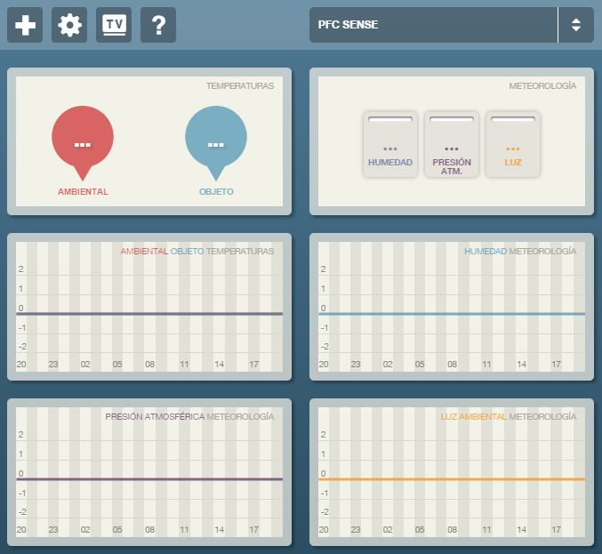

# 5.6. Iteración 4: Monitorización remota de los valores de los sensores

Como ya comentamos en la elección de herramientas del Capítulo 3, vamos a utilizar la plataforma web Ducksboard para la monitorización web de los datos de los sensores de temperatura. Esta plataforma permite la creación de paneles de monitorización de gráficas a través de una API para enviar información desde tu propia aplicación. Haremos uso de esta API para modificar los valores de las gráficas que creemos, para ello, las tareas que tendremos que realizar son las definidas en la Tabla 5.6.1.

| Tarea | Descripción |
| -- | -- |
| 4.1 | Configuración de gráficas en Ducksboard |
| 4.2 | Envío de datos al dashboard |
##### *Tabla 5.6.1: Tareas de la iteración 4* 


## 5.6.1. Configuración de gráficas en Ducksboard

Para ceñirnos al análisis que del diseño del panel de monitorización web que definimos en el Capítulo 4, crearemos una gráfica con los valores actuales por cada perfil GATT de los sensores y una gráfica de lineas para ir almacenando los valores históricos de los diferentes sensores. El resultado del panel creado se puede observar en la Figura 5.6.1.


##### *Figura 5.6.1: Diseño de panel en Ducksboard*

Cada una de estas gráficas tiene asociado un widgetID para hacer push a las mismas, lo que haremos será guardar estos identificadores en nuestro código y asignar un widgetID por defecto a los valores de cada perfil GATT como vemos en Código 5.6.1.

```java
private static final String DEFAULT_WIDGET_VALUE_TEMPERATURE = "730979";
private static final String DEFAULT_WIDGET_VALUE_TEMPERATURE_IR = "730980";
private static final String DEFAULT_WIDGET_VALUE_HUMIDITY = "730981";
private static final String DEFAULT_WIDGET_VALUE_BAROMETER = "730982";
private static final String DEFAULT_WIDGET_VALUE_LUXOMETER = "730983";
private static final String DEFAULT_WIDGET_GRAPHIC_TEMPERATURE = "730985";
private static final String DEFAULT_WIDGET_GRAPHIC_TEMPERATURE_IR = "730986";
private static final String DEFAULT_WIDGET_GRAPHIC_HUMIDITY = "730988";
private static final String DEFAULT_WIDGET_GRAPHIC_BAROMETER = "730989";
private static final String DEFAULT_WIDGET_GRAPHIC_LUXOMETER = "730990";
```