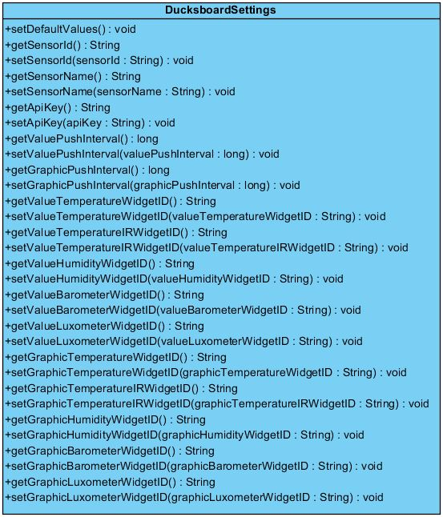
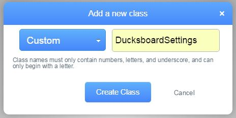
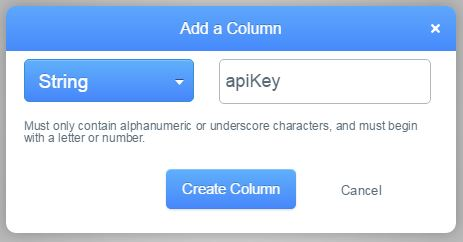
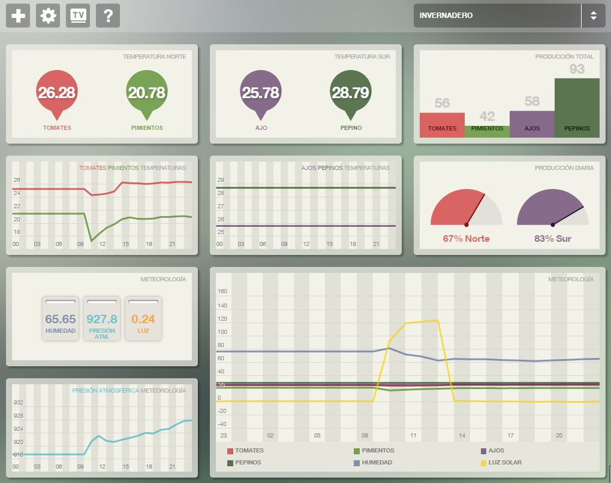

# 5.7. Iteración 5: Configuración de dashboard de monitorización

Ya tenemos el dashboard de monitorización creado, pero este tiene un problema, y es que actualmente todos los sensores con los que nos conectemos enviarán la información de temperaturas al mismo panel. Por lo tanto, es necesario crear un entorno remoto, en el cual el administrador pueda configurar un panel para cada sensor dado de alta y así el supervisor pueda convenientemente visualizar aquellos datos de todos los sensores que necesite según sean sus necesidades particulares.

| Tarea | Descripción |
| -- | -- |
| 5.1 | Creación de modelo de configuración de Ducksboard |
| 5.2 | Consulta de configuración en aplicación móvil |
| 5.3 | Configuración de dashboards personalizados para un supervisor |
##### *Tabla 5.7.1: Tareas de la iteración 5* 

## 5.7.1. Creación de modelo de configuración de Ducksboard

El modelo que necesitamos crear para la configuración del panel para que sea totalmente configurable por el administrador necesita de los siguientes valores:

- Identificador del sensor configurado
- API key de la cuenta de Ducksboard
- Intervalo de frecuencia de actualización para los widgets de valores
- Intervalo de frecuencia de actualización para los widgets de las gráficas
- Identificador del widgetID para los valores y las graficas de cada servicio GATT

Por lo tanto, el diseño del modelo tendría la forma que se observa en la Figura 5.7.1.


##### *Figura 5.7.1: Diagrama del modelo de DucksboardSettings*

Este modelo tiene que tener su correspondencia en un entorno web configurable por el administrador. Para ello, haremos uso de la plataforma de Parse para su creación. La creación de modelos en Parse es muy sencillo, basta con ir a la sección *Data* y seleccionar la opción *+ Add Class*, entonces aparecerá un dialogo en el que indicaremos que se trata de una clase *Custom* con el nombre ```DucksboardSettings``` tal y como se muestra en la Figura 5.7.2.


##### *Figura 5.7.2: Creación en Parse de la clase DucksboardSettings*

Posteriormente, sólo hará falta ir añadiendo columnas a la tabla con el nombre y tipo que elijamos según nos vayan haciendo falta. Para ello seleccionaremos la opción *+ Col* del panel de Parse y nos aparecerá un dialogo muy fácil de configurar, como se puede apreciar en la Figura 5.7.3 para la creación de la columna ```apiKey```. Tendremos que repetir este proceso hasta completar el resto de columnas necesarias según indica el modelo que se ve en la Figura 5.7.1.


##### *Figura 5.7.3: Creación en columnas de la clase DucksboardSettings*

Una vez creada la clase, el administrador puede rellenar los datos del sensor configurado con los valores recuperados del panel que desee desee configurar. Esta configuración servirá para que la consulte la aplicación móvil y envíe los push de monitorización al panel adecuado.


## 5.7.2. Consulta de configuración en aplicación móvil

Para recuperar desde la aplicación móvil la configuración creada en Parse es necesario previamente hacer una serie de configuraciones en la aplicación. Lo primero es añadir una serie de permisos en nuestro archivo ```AndroidManifest.xml``` tal y como se ve en el Código 5.7.1. Esto nos proveerá los permisos necesarios para poder hacer uso de internet para la recuperación de la configuración. También será necesario añadir las dependencias del SDK de Parse en nuestro archivo de configuración de gradle como se ve en el Código 5.7.2.

```xml
<uses-permission android:name="android.permission.INTERNET" />
<uses-permission android:name="android.permission.ACCESS_NETWORK_STATE" />
```
##### *Código 5.7.1: Configuración de uso de Parse en AndroidManifest.xml*

```javascript
dependencies {
    compile 'com.parse.bolts:bolts-android:1.+'
    compile 'com.parse:parse-android:1.+'
}
```
##### *Código 5.7.2: Dependencias del SDK de Parse en build.gradle*


Además, crearemos un método ```initApp()``` en un nuevo controlador ```ParseController``` para iniciar ciertos parámetros necesarios para hacer uso del SDK de Parse como son la API key y el registro de la subclases ```DucksboardSettings``` como muestra el Código 5.7.3. Conforme se vayan agregando clases al modelo será necesario añadirlas en el método ```registerSubclasses()```.

```java
public void initApp(Context context) {
    registerSubclasses();
    Parse.enableLocalDatastore(context);
    Parse.initialize(context, APPLICATION_ID, CLIENT_KEY);
    configureACL();
}

private void registerSubclasses() {
    ParseObject.registerSubclass(DucksboardSettings.class);
}
```
##### *Código 5.7.3: Inicio de aplicación para el uso de Parse en ParseController.java*

Una vez configurado la aplicación para hacer uso de Parse ya podemos consultar cual es la configuración para nuestro sensor activo. Para ello agregaremos un método en ```DucksboardController``` tal y como podemos ver en Código 5.7.4 para recuperar e iniciar los parámetros de Ducksboard asociados a este sensor. Si no tiene asociado ninguna configuración, le asignaremos la del panel por defecto y la guardaremos en servidor para que sea más fácil editarla por el administrador.

```java
public void initDuckboardSettings(final SensorInfo sensorInfo) {
    ParseQuery<DucksboardSettings> query = ParseQuery.getQuery(DucksboardSettings.class);
    query.whereEqualTo(DucksboardSettings.PROPERTY_SENSOR_ID, sensorInfo.getSensorId());
    query.findInBackground(new FindCallback<DucksboardSettings>() {
        @Override
        public void done(List<DucksboardSettings> results, ParseException e) {
            if (results != null && !results.isEmpty()) {
                _settings = results.get(0);
            } else {
                _settings = new DucksboardSettings();
                _settings.setSensorId(sensorInfo.getSensorId());
                _settings.setSensorName(sensorInfo.getSensorName());
                _settings.setDefaultValues();
                _settings.saveInBackground();
            }
        }
    });
}
```
##### *Código 5.7.4: Inicio de applicación para uso de Parse en ParseController.java*

Como se puede observar en el Código 5.7.4, haciendo uso del SDK de Parse, la consulta y guardado de parámetros de objetos es muy sencilla de usar. Provee métodos asíncronos tanto para la recuperación de datos como para su persistencia en la plataforma web.

## 5.7.3. Configuración de dashboards personalizados para un supervisor

Una vez ya construido el entorno necesario tanto en Parse como en la aplicación móvil, generar la configuración para añadir un nuevo panel dahsboard personalizado para las necesidades de un supervisor en particular es muy sencillo. Bastará con ir a Ducksboard, crear un nuevo panel y añadir los widgets que el supervisor necesite, luego iremos a Parse y editaremos las tuplas de los sensores relacionados asociandoles los widgetID oportunos. Además podremos cambiar desde dicha tupla el intervalo de monitorización de los widgets asociados, según sean las necesidades del supervisor. En la Figura 5.7.4 vemos un ejemplo de un panel de monitorización de un invernadero, pero podría configurarse para infinidad de usos, tantos como necesidades indiquen los supervisores que van a utilizar la aplicación.


##### *Figura 5.7.: Ejemplo de dashboard para control de un invernadero *

Los *dashboards* también pueden ser exportables mediante la creación de una url pública sin tener que hacer uso de password y usuario para entrar en el entorno de Ducksboard. Además la plataforma también permite exportar los widgets de forma individual como *iframes* y así incluirlos en cualquier página html si fuera necesario.


