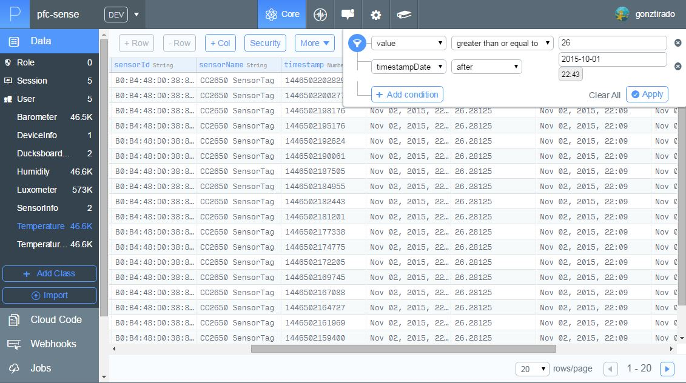
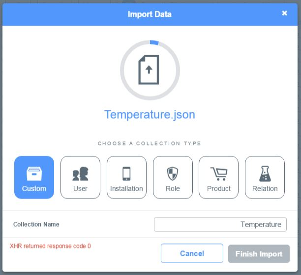

# 5.8. Iteración 6: Consulta y exportación de datos históricos

Para el envío de datos haremos uso de la plataforma web de Parse. Como ya configuramos la aplicación para hacer uso de su SDK, sólo nos quedará configurar y actualizar el controlador para enviar también los valores que vayan tomando los diferentes valores de los perfiles GATT. Posteriormente explicaremos como consultar estos datos en la plataforma web y como hacer copia de seguridad de los mismos. Todas estas tareas están desglosadas en la Tabla 5.8.1.

| Tarea | Descripción |
| -- | -- |
| 6.1 | Envío de datos de sensores desde aplicación móvil|
| 6.2 | Consulta y filtrado de datos|
| 6.3 | Creación de copias de seguridad|
##### *Tabla 5.8.1: Tareas de la iteración 6* 

## 5.8.1. Envío de datos de sensores desde aplicación móvil

Cómo ya tenemos el SDK de Parse totalmente configurado, para guardar los datos de los sensores sólo hará falta registrar en ParseController las subclases que queremos utilizar como se puede observar en el Código 5.8.1. Además, todas estas clases las haremos que hereden de ```ParseObject``` para que la aplicación funcione correctamente.

```java
private void registerSubclasses() {
    ParseObject.registerSubclass(DeviceInfo.class);
    ParseObject.registerSubclass(SensorInfo.class);
    ParseObject.registerSubclass(SensorData.class);
    ParseObject.registerSubclass(TemperatureData.class);
    ParseObject.registerSubclass(TemperatureIRData.class);
    ParseObject.registerSubclass(BarometerData.class);
    ParseObject.registerSubclass(HumidityData.class);
    ParseObject.registerSubclass(LuxometerData.class);
    ParseObject.registerSubclass(DucksboardSettings.class);
}
```
##### *Código 5.8.1: Registros de clases del modelo en ParseController.java*

Para persistir los objetos en la plataforma web, sólo tendremos que invocar al método ```saveInBackground()``` que ahora disponen las clases del modelo por heredar de ```ParseObject```. Además del valor devuelto por los diferentes perfiles GATT, le agregaremos la fecha en que fue tomada antes de almacenarlos en Parse. Todo lo explicado anteriormente puede observarse en el Código 5.8.2.

```java
public void addTemperatureValue(double value) {
    TemperatureData data = new TemperatureData();
    addSensorValue(data, value);
    DucksboardController.getInstance().pushTemperatureData(data);
}

...

private void addSensorValue(SensorData sensorData, double value) {
    sensorData.setSensorInfo(getCurrentSensorInfo());
    sensorData.setValue(value);
    sensorData.setTimestamp(System.currentTimeMillis());
    sensorData.saveInBackground();
}
```
##### *Código 5.8.2: Persistencia del modelo SensorDataController.java*


## 5.8.2. Consulta y filtrado de datos

Una vez realizado el envío de datos desde la aplicación móvil, la consulta de los mismos en la plataforma de Parse resulta muy sencilla, basta con acceder a la sección *Data* y seleccionar la clase que queremos visualizar. Una vez ahí podemos filtrar los datos por los campos que deseemos tal y como se muestra en la Figura 5.8.1.


##### *Figura 5.8.1: Consulta de datos en Parse*


## 5.8.3. Creación de copias de seguridad

Realizar copias de seguridad resulta igual de sencillo, basta con aplicar el filtro deseado tal y como se muestra en la Figura 5.8.1 y darle a la opción *Export the data*. Una vez realizada la copia de seguridad se enviará al correo del usuario un archivo JSON que contiene el volcado de los datos seleccionados. Si no se selecciona ningún filtro se hará un volcado de toda la tabla de datos.

Igualmente, el proceso de importar una copia de seguridad resulta sumamente fácil. Sólo será necesario seleccionar la opción *Import* y cargar el archivo JSON previamente guardado como puede observarse en la Figura 5.8.2.


##### *Figura 5.8.1: Importación de datos en Parse*


