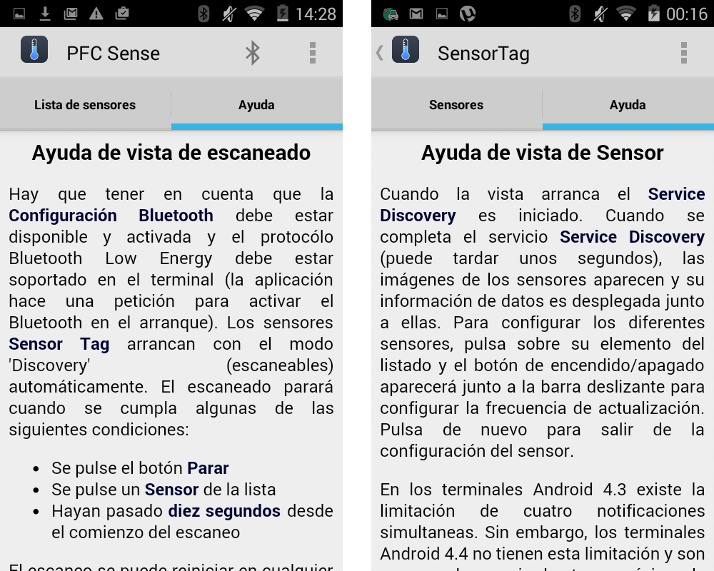
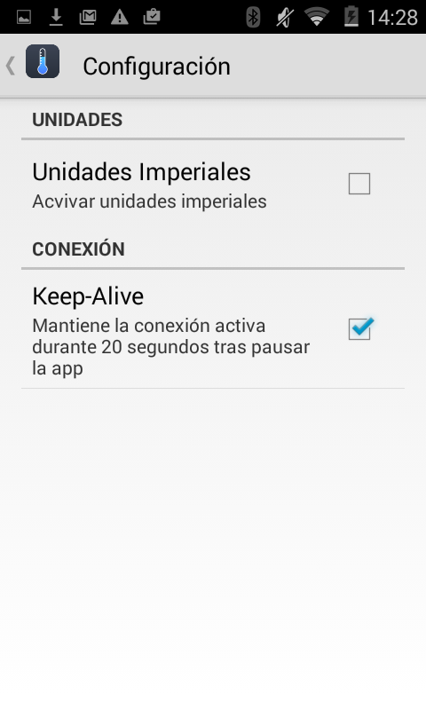

# 5.9. Iteración Final: Revisión de aplicación y últimas mejoras

Para rematar la aplicación se ha decidido añadir algunas funcionalidades que, aunque no son de vital importancia para el comportamiento de la misma, si tienen valor en cuanto a la experiencia del usuario que la haga uso de ella. Se va a incluir secciones de ayuda en la propia aplicación que expliquen el uso de la misma, además de una pantalla de configuración con opciones de personalización. Por último se añadirán enlaces al repositorio del código, a la versión online de la propia memoria, a la licencia del proyecto y a la configuración Bluetooth del dispositivo. Estas tareas están desglosadas en la Tabla 5.9.1.

| Tarea | Descripción |
| -- | -- |
| F.1 | Incluir ayuda en la aplicación |
| F.2 | Añadir pantalla de configuración|
| F.3 | Incluir enlaces de interés|
##### *Tabla 5.9.1: Tareas de la iteración final * 

## 5.9.1. Incluir ayuda en la aplicación

Ya se introdujeron en el diseño inicial realizado en el Capítulo 4 unos menú superiores que permitían ver ayuda de como usar la propia aplicación. Se ha mantenido el mismo diseño tal y como puede observarse en la Figura 5.9.1. Además, para que la edición de la misma sea más fácil se ha utilizado un ```WebView``` que permite cargar contenido html estático incluido en la propia aplicación.


##### *Figura 5.9.1: Pantallas de ayuda* 


## 5.9.2. Añadir pantalla de configuración
Se ha incluido una pantalla de configuración accesible desde la pantalla de monitorización de sensores. Como se observa en la Figura 5.9.2, esta pantalla permite cambiar la visualización de las medidas para hacer uso de las unidades imperiales en lugar del sistema métrico. Además se le ha incluido un módo que permite mantener la conexión bluetooth activa durante 20 segundos tras pausar la aplicación  


##### *Figura 5.9.2: Pantalla de configuracion* 


## 5.9.3. Incluir enlaces de interés