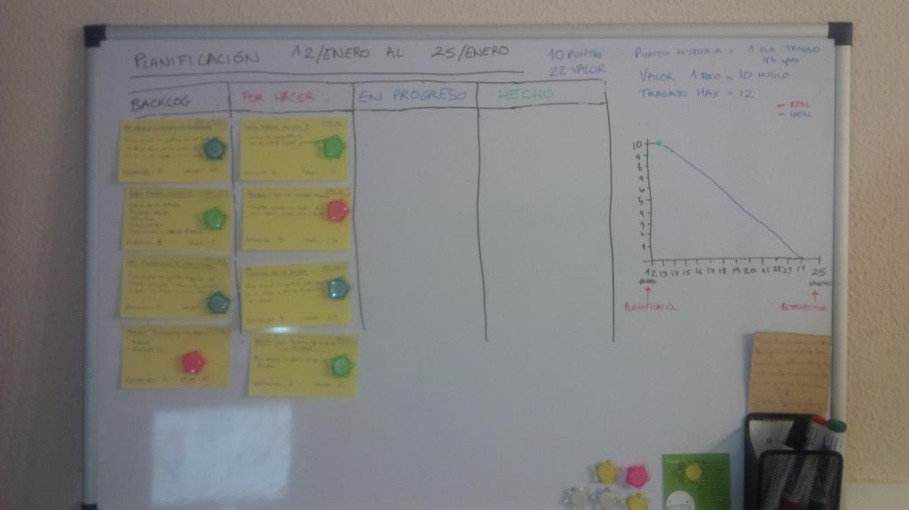

# Iteraciones

| Iteración | Versión | Requerimiento                                        |   
| --------- | ------- | ---------------------------------------------------- |
| 1         | 0.1.0   | Consultar listado de sensores                        |
| 2         | 0.2.0   | Monitorizar los valores de las temperaturas in situ  | 
| 3         | 0.3.0   | Configurar sensores                                  | 
| 4         | 0.4.0   | Monitorización remota de los valores de los sensores | 
| 5         | 0.5.0   | Configuración de dashboard de monitorización         | 
| 6         | 0.6.0   | Consulta y exportación de datos históricos           |
| 7         | 1.0.0   | Revisión de aplicación y últimas mejoras             |
###### *Tabla 1: Iteraciones a realizar previstas*

