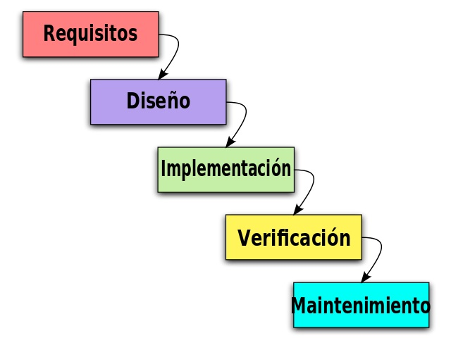

# Metodología de desarrollo

## Desarrollo en cascada

A la hora de desarrollar software tradicionalmente se ha optado por el modelo de desarrollo en cascada, denominado así por la posición de las fases en el desarrollo de esta, que parecen caer en cascada "por gravedad" hacia las siguientes fases. En este tipo de marco de trabajo, al final de cada etapa, se lleva a cabo una revisión final, que se encarga de determinar si el proyecto está listo para avanzar a la siguiente fase. Este modelo fue el primero en originarse y es la base de todos los demás modelos de ciclos de desarrollo clásicos. Las fases en las que se compone suelen ser:

###### *Figura 1: Fases del desarrollo en cascada*

Este tipo de modelo tiene algunas características deseables en cualquier desarrollo como son el rápido aprendizaje y entendimiento, hace incapié en documentar el proyecto y promueve metodologías de trabajo efectivas como es el definir antes que diseñar y diseñar antes que codificar.

Sin embargo, en la vida real, un proyecto rara vez sigue una secuencia lineal, esto crea una mala implementación del modelo, lo cual hace que lo lleve al fracaso. Cualquier error de diseño detectado en la etapa de prueba conduce necesariamente al rediseño y nueva programación del código afectado, aumentando los costos del desarrollo. Además, una etapa determinada del proyecto no se puede llevar a cabo a menos de que se haya culminado la etapa anterior, lo cual hace que se tarde mucho en recibir *feedback* del proyecto y cuando llega a veces es muy costoso realizar cambios en el mismo.

Aun habiendo ya definidos ya los requisitos y el diseño iniciales para la aplicación propios de la forma tradicional de desarrollar software o también llamada desarrollo en cascada, donde cada una de estas partes se toman un tiempo considerable para analizar profundamente el plan de desarrollo y que este sea inamovible, **se va a optar por realizar un plan de desarrollo ágil**, donde todo lo considerado se revisará y modificará si se estimara oportuno. 

## Desarrollo ágil

