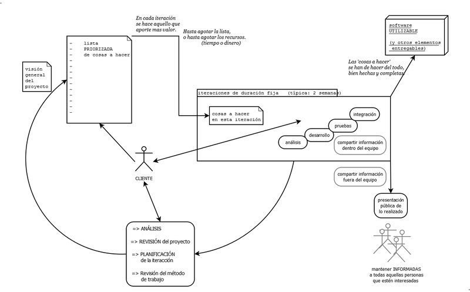

# Metodología de desarrollo

## Desarrollo en cascada

A la hora de desarrollar software tradicionalmente se ha optado por el modelo de desarrollo en cascada, denominado así por la posición de las fases en el desarrollo de esta, que parecen caer en cascada "por gravedad" hacia las siguientes fases. En este tipo de marco de trabajo, al final de cada etapa, se lleva a cabo una revisión final, que se encarga de determinar si el proyecto está listo para avanzar a la siguiente fase. Este modelo fue el primero en originarse y es la base de todos los demás modelos de ciclos de desarrollo clásicos. Las fases en las que se compone suelen ser:

###### *Figura 1: Fases del desarrollo en cascada*

Este tipo de modelo tiene algunas características deseables en cualquier desarrollo como son el rápido aprendizaje y entendimiento, hace incapié en documentar el proyecto y promueve metodologías de trabajo efectivas como es el definir antes que diseñar y diseñar antes que codificar.

Sin embargo, en la vida real, un proyecto rara vez sigue una secuencia lineal, esto crea una mala implementación del modelo, lo cual hace que lo lleve al fracaso. Cualquier error de diseño detectado en la etapa de prueba conduce necesariamente al rediseño y nueva programación del código afectado, aumentando los costos del desarrollo. Además, una etapa determinada del proyecto no se puede llevar a cabo a menos de que se haya culminado la etapa anterior, lo cual hace que se tarde mucho en recibir *feedback* del proyecto y cuando llega a veces es muy costoso realizar cambios en el mismo.

Aun habiendo ya definidos ya los requisitos y el diseño iniciales para la aplicación propios de la forma tradicional de desarrollar software o también llamada desarrollo en cascada, donde cada una de estas partes se toman un tiempo considerable para analizar profundamente el plan de desarrollo y que este sea inamovible, **se va a optar por realizar un plan de desarrollo ágil**, donde todo lo considerado se revisará y modificará si se estimara oportuno. 

## Desarrollo ágil

Las metodologías de trabajo ágiles vienen a paliar algunas de las deficiencias que tiene el desarrollo tradicional en cascada pero manteniendo el espiritu y las buenas prácticas de la anterior metodología. Principalmente se basa en repetir de forma iterativa las diferentes fases que conforman el desarrollo en cascada en iteraciones de pequeño tamaño con el fin de que si hay algún fallo de diseño, algún error en la toma de especificiones o incluso el cambio de las mismas no resulte un varapalo para el proyecto. Además, en las metodologías ágiles al final de cada iteración se genera un producto que se entrega y se revisa por aquellos que van a utilizarlo, recibiendo feedback y encontrando errores de forma más temprana.

###### *Figura 2: Esquema típico de desarrollo ágil*

Algunas de las metodogías ágiles más extendidas son:

### Scrum

Scrum es una metodología ágil, basada en desarrollo incremental. Se trata de una metodología muy extendida. En ella se suelen adoptar diferentes róles a los miembros de la organización, con el fin de organizar mejor la distribución de la responsabilidad de las diferentes tareas. Los roles comúnmente usados son el Product Owner, el Scrum Master y el equipo de desarrollo. Además unas de sus características destacables son:

- Divide la organización en equipos pequeños, interdisciplinarios y auto-organizados.
- Divide el trabajo en una lista de entregables pequeños y concretos y la ordena la lista por orden de prioridad estimando el esfuerzo relativo de cada elemento.
- Divide el tiempo en iteraciones cortas de longitud fija (generalmente de 1 a 4 semanas), con código potencialmente entregable y validado después de cada iteración.
- Optimiza el plan de entregas y actualiza las prioridades en colaboración con el cliente, basada en los conocimientos adquiridos mediante la inspección del entregable después de cada iteración.

### Kanban
Kanban es un método para gestionar el trabajo intelectual, con énfasis en la entrega justo a tiempo, mientras no se sobrecargan a los miembros del equipo. En este enfoque, el proceso, desde la definición de una tarea hasta su entrega al cliente, se muestra para que los participantes lo vean y los miembros del equipo tomen el trabajo de una cola. Sus principios básicos son:

- Se visualiza el plan de trabajo, diviendo el trabajo en bloques, generalmente de la misma complejidad.
- Limita el trabajo en curso asignando límites concretos a cuantos elementos deben estar en cada flujo de trabajo.
- Mide el tiempo medio en completar un elemento y se optimiza el proceso para que este tiempo sea lo más pequeño y predecible posible.

### Extreme programming (XP)
 Al igual que éstos, la programación extrema se diferencia de las metodologías tradicionales principalmente en que pone más énfasis en la adaptabilidad que en la previsibilidad. Los defensores de la XP consideran que los cambios de requisitos sobre la marcha son un aspecto natural, inevitable e incluso deseable del desarrollo de proyectos. Creen que ser capaz de adaptarse a los cambios de requisitos en cualquier punto de la vida del proyecto es una aproximación mejor y más realista que intentar definir todos los requisitos al comienzo del proyecto e invertir esfuerzos después en controlar los cambios en los requisitos.

- **Desarrollo iterativo e incremental**, se aplican pequeñas mejoras, unas tras otras.
- **Pruebas unitarias continuas**, deben ser frecuentemente repetidas y preferiblemente automatizadas.
- **Programación en parejas**, se recomienda que las tareas de desarrollo se lleven a cabo por dos personas en un mismo puesto. La mayor calidad del código escrito de esta manera es más importante que la posible pérdida de productividad inmediata.
- **Frecuente integración del equipo de programación con el cliente o usuario**. Se recomienda que un representante del cliente trabaje junto al equipo de desarrollo.
- **Corrección de todos los errores** antes de añadir nueva funcionalidad. Hacer entregas frecuentes.
- **Refactorización del código**, es decir, reescribir ciertas partes del código para aumentar su legibilidad y mantenibilidad pero sin modificar su comportamiento. Las pruebas han de garantizar que en la refactorización no se ha introducido ningún fallo.
- **Propiedad del código compartida**: en vez de dividir la responsabilidad en el desarrollo de cada módulo en grupos de trabajo distintos, este método promueve el que todo el personal pueda corregir y extender cualquier parte del proyecto. Las frecuentes pruebas de regresión garantizan que los posibles errores serán detectados.
- **Simplicidad en el código**: es la mejor manera de que las cosas funcionen. Cuando todo funcione se podrá añadir funcionalidad si es necesario. La programación extrema apuesta que es más sencillo hacer algo simple y tener un poco de trabajo extra para cambiarlo si se requiere, que realizar algo complicado y quizás nunca utilizarlo.

