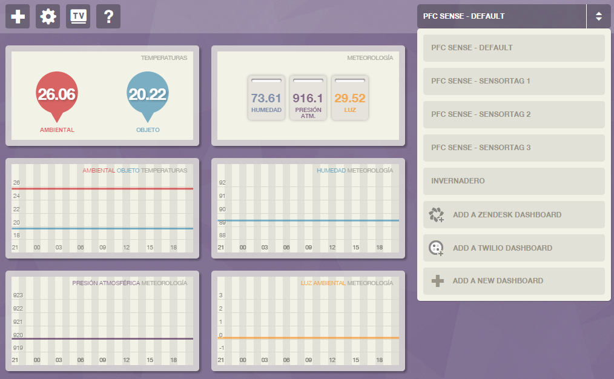
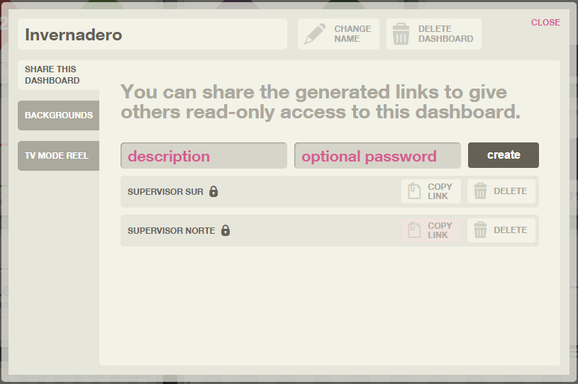
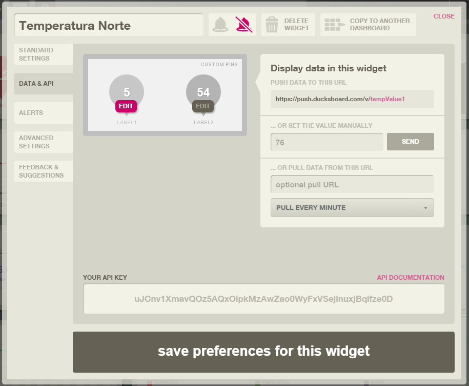
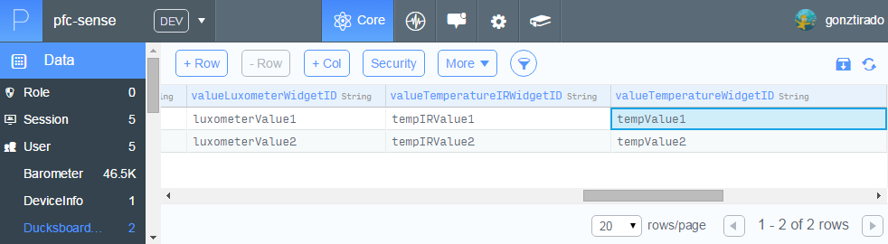
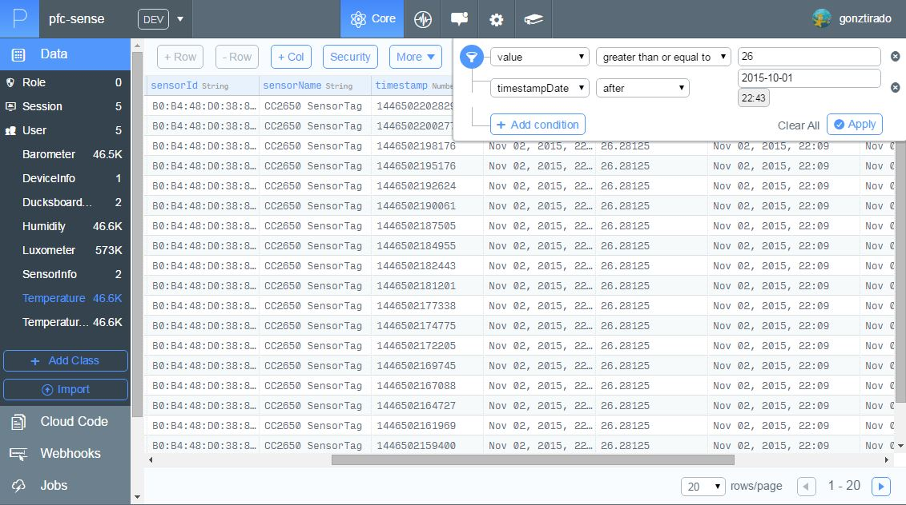
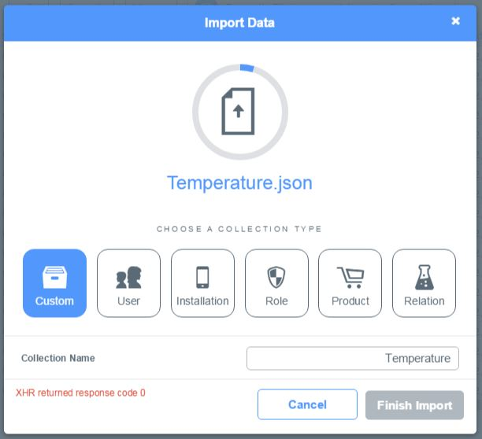

# Administración web

Esta será la herramienta que use el usuario que tome el rol de administrador, con ella podrá  configurar las pizarras de monitorización, filtrar los datos de los sensores que necesite buscar, realizar copias de seguridad y hacer restauraciones de datos en el caso de que fuera necesario

## Configuración de pizarras de monitorización

Cuando sea necesario **crear o editar una pizarra**, habrá que entrar en el entorno de Ducksboard y autenticarse con su usuario y password de administración. Una vez dentro de la plataforma, si se selecciona el menú de selección de panel de la derecha que se ve en la Figura A.6 puede seleccionarse la opción 'Add a new dashboard'.

##### *Figura A.6: Crear nuevo dashboard en Ducksboard*

Una vez creado el panel, darle **acceso a los supervisores** es muy sencillo, basta con pulsar el icono de configuración que se ve arriba a la izquierda en la Figura A.6 y seleccionar la opción "Preferences for this dashboard", una vez hecho esto aparecerá el popup que podemos ver en la Figura A.7. Esta pantalla nos permite crear enlaces protegidos con password para cada supervisor que necesite visualizar el panel. Si se deseara bloquear el acceso para un supervisor, bastaría con seleccionar la opción 'Delete'.

##### *Figura A.7: Configurar supervisores en Ducksboard*

Para añadir basta con pulsar el ícono de añadir que se encuentra en la botonera situada arriba a la izquierda del panel que se ve en la Figura A.6. Una vez añadido, para configurarlo para que reciba los datos de un determinado sensor, pulsaremos sobre el widget y seleccionaremos la sección 'Data & API' que se ve en la Figura A.8. Ahí podremos editar el valor del widgetID y seleccionar el identificador que estimemos oportuno.

##### *Figura A.8: Configurar widget en Ducksboard*

Una vez seleccionado el widgetID necesitaremos asignarselo a un determinado sensor, para ello haremos uso de nuestro entorno de administración en Parse tal y como vemos en la Figura A.9.

##### *Figura A.9: Configuración de widget en Parse*

## 6.2.2. Administración de datos

El entorno de administración que proporciona Parse resulta muy intuitivo para todo aquel que ha interaccionado alguna vez con un *backoffice* con edición *CRUD*. Para hacer la tarea de consulta y filtrado de datos basta con acceder a la sección 'Data', seleccionar la tabla que queremos consultar y aplicar el filtro superior que se considere oportuno tal y como se muestra en la Figura 6.2.5.

##### *Figura 6.2.5: Consulta y filtrado de datos en Parse*

Para realizar copias de seguridad es necesario seleccionar el icono de 'Export' habiendo seleccionado previamente el filtro adecuado, aunque, también se puede realizar una exportación de la tabla completa. Una vez terminada la exportación, se enviará la copia de seguridad al correo del administrador en formato JSON.

A su vez, realizar un importación de datos no entabla ningún problema, sólo es necesario pulsar el botón 'Import' y cargar el archivo JSON previamente generado como se ve en la Figura 6.2.6.

##### *Figura 6.2.64: Importación de datos en Parse*
