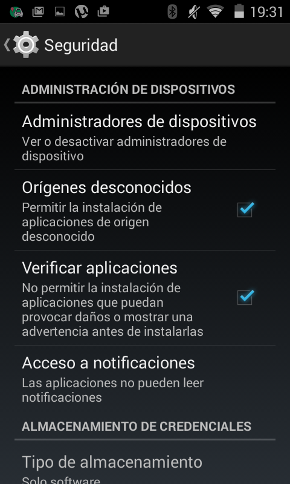
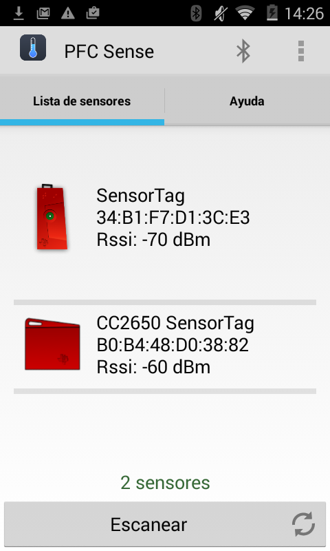
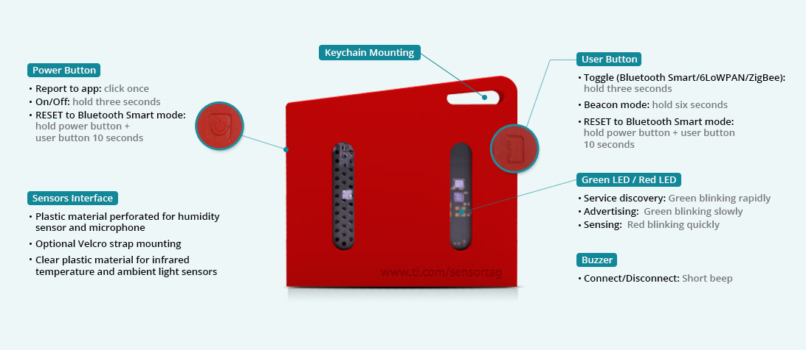
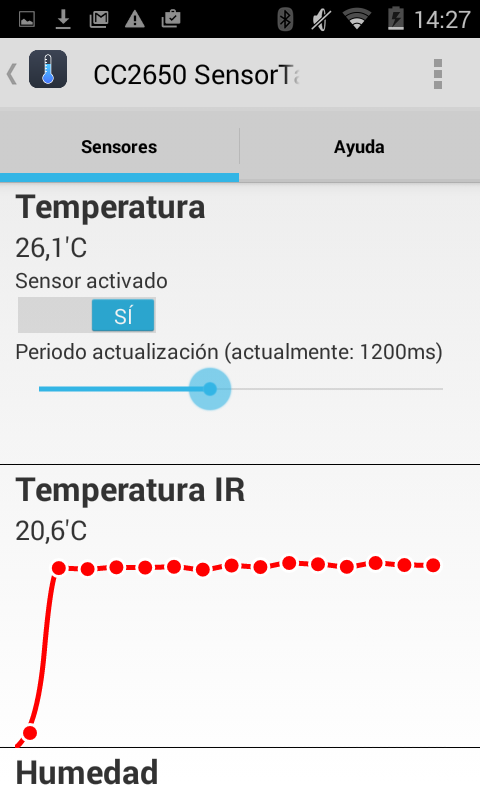
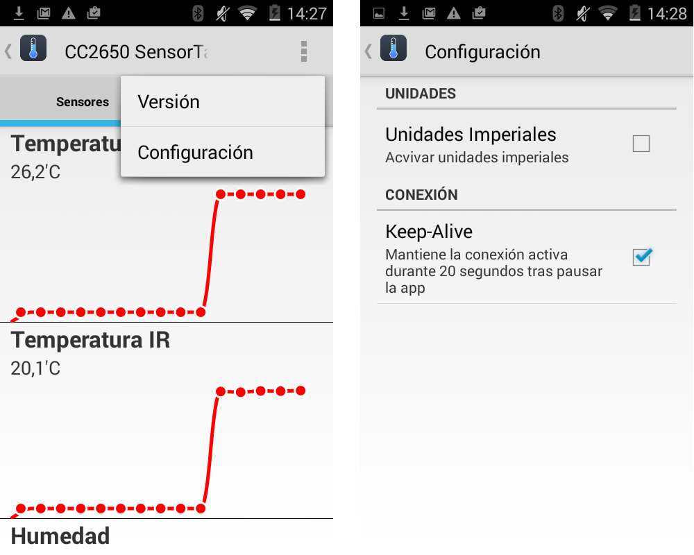

# Aplicación móvil

La aplicación móvil es la que usaran los técnicos de campo para sincronizar los sensores y monitorizar la temperatura de los mismos. Se ha creado una interfaz simple e intuitiva para que la curva de aprendizaje sea lo más pequeña posible. De todas formas, se explicara como instalar la aplicación, como sincronizar los sensores y como configurarlos convenientemente.

## Instalación

El primer paso para poder usar la aplicación para Android es instalarla convenientemente, para ello se proporciona un archivo instalable ```pfc-sense-app.apk``` que previamente se ha proporcionado. Para instalarlo basta con pulsar sobre el archivo instalado en el dispositivo Android. 

Puede ocurrir que el despositivo no permita instalar aplicaciones que provengan de la tienda oficial de aplicaciones Android *Google Play*. En ese caso, tendremos que activar la opción de instalación de aplicaciones desde orígines desconocidos tal y como se observa en la Figura A.1. Esta se encuentra en el menú de configuración del dispositivo en la sección 'Seguridad'.


##### Figura A.1: Instalación de aplicaciones desde orígenes desconocidos


## Sincronización de sensores

Nada más arrancar, el técnico tiene acceso a la pantalla de sincronización de sensores que se observa en la Figura A.2. Para visualizar los sensores disponibles para su conexión deberá darle al botón 'Escanear', una vez que termina el escaneado podrá seleccionar el sensor al que desea sincronizarse.


##### Figura A.2: Pantalla de sincronización de sensores

Si no aparece el sensor al que se quiere conectar en la lista de dispositivos disponibles es posible que sea porque se ha puesto en *stand-by* para ahorrar batería, en ese caso se puede activar fácilmente pulsando el botón de encendido que muestra la Figura A.3.


##### Figura A.3: Detalle de botón de encendido

## Configuración de sensores

Una vez seleccionado un sensor de la lista, se procederá a la conexión con el mismo. Tras la conexión, se mostrará la pantalla de monitorización de los servicios disponibles por el sensor. Si se pulsa sobre uno de los servicios listados, aparecerá el bloque de configuración del mismo. Esta configuración permite habilitar/deshabilitar el sensor y cambiar el tiempo de refresco de sus valores como puede observarse en la Figura A.4.


##### Figura A.4: Configuración de un servicio del sensor


Además, existe la posibilidad de cambiar las unidades de medida por unidades imperiales en lugar de las del sistema métrico. También es posible configurar la aplicación en modo *Keep-Alive* para que no se pierda la conexión con el sensor cuando la aplicación se pausa. Esta pantalla de configuración es accesible desde el menú de la barra de título de la pantalla del sensor tal y como se ve en la Figura 6.1.5.


##### Figura 6.1.5: Pantalla de configuración de sensores