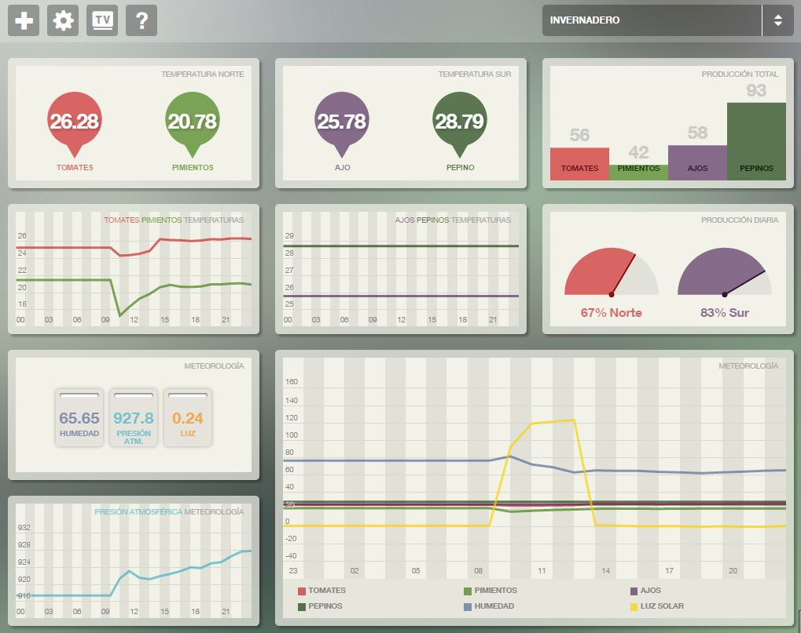

# 6.3. Monitorización remota

El dashboard de monitorización remota que usaran los supervisores no requiere de mucha explicación. Los supervisores podrán consultar su panel de monitorización a través de la url y el password que les proporcionó su administrador. En la Figura 6.3.1 podemos observar un ejemplo de un panel creado para la supervisión de un invernadero.

##### *Figura 5.7.: Ejemplo de dashboard para la supervisión de un invernadero *