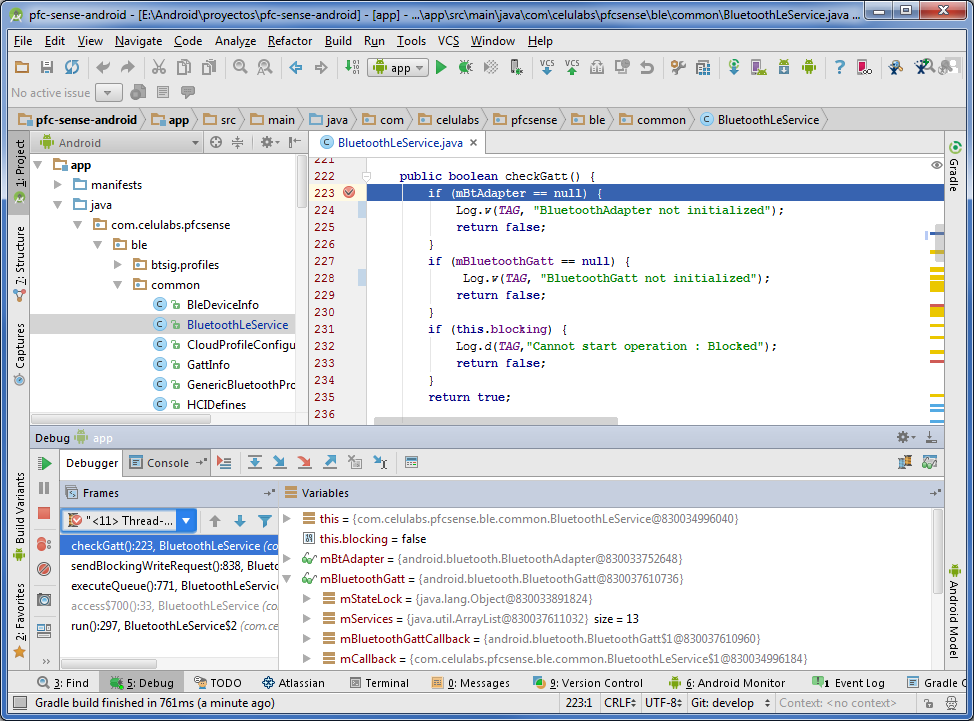

# 7.1. Depuración y busqueda de errores

Para verificar el funcionamiento de la aplicación, se ha hecho uso del depurador de Android Studio conectado con el terminal ya que no nos era posible hacer las pruebas directamente con el simulador porque necesitábamos de la conectividad Bluetooth. Haciendo uso del depurador de Android hemos verificado cada nueva funcionalidad que hemos ido añadiendo en las diferentes iteraciones.

##### *Figura 7.1.1: Depuración con Android Studio* 

Además, hemos añadido trazas de log, para verificar el funcionamiento de la aplicación en un entorno en el que no teníamos capacidad de tener conectado el smartphone con el PC.