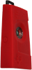
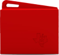

# 7.2. Desempeño del sensor

Se han realizado varias pruebas para determinar el correcto funcionamiento de los sensores. Las pruebas varias entre determinar el alcance de la conexión Bluetooth, como de calibración de las distintas medidas que recuperan los sensores.

| Imágen | Modelo del Sensor | Rango sin obstaculos | Rango con obstáculos | Error de temperatura |
| -- | -- | -- | -- | -- |
| | SensorTag | 10 metros | 4 metros | +- 2º C |
|  | SensorTag CC2650 | 15 metros | 5 metros | +-5º C |
