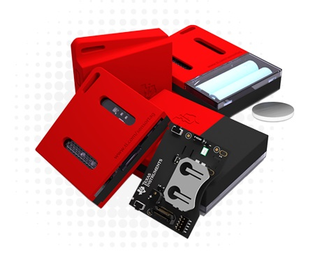
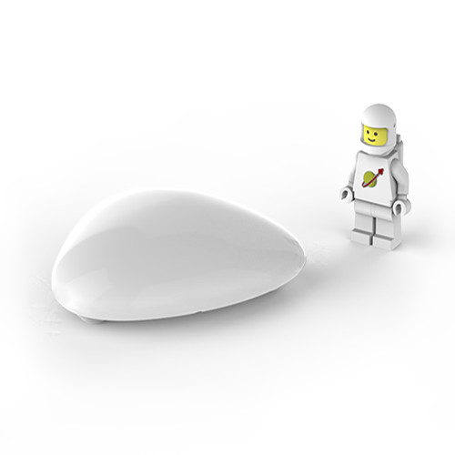
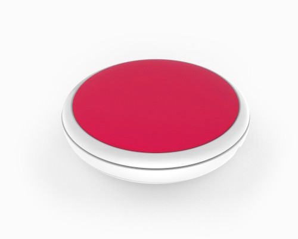
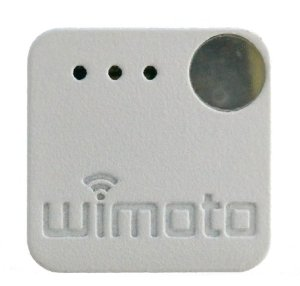
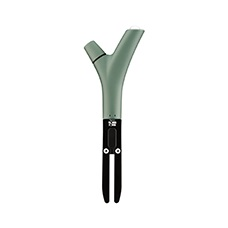
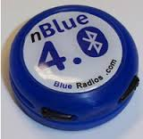
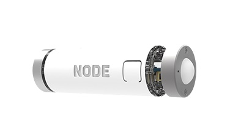

# Termógrafos

El siguiente paso en la investigación de tecnologías a utilizar consiste en encontrar un sensor apropiado para consultar la temperatura. 

## Protocolos de comunicación inalámbrica

El primer paso consiste en determinar que tecnología inalámbrica vamos a utilizar en la conectividad con lo sensores, vamos a realizar una comparativa de los diferentes protocolos existentes para determinar la elección del sensor.

### Wifi (802.11 a/b/g/n)
 - Disponible en todos los terminales móviles.
 - Mantener el canal de comunicación wifi con un sensor consume bastante energía.
 - Además, si se mantiene el canal abierto con un canal no podríamos conectarnos a nuestra red local para conectarnos a internet
 - Los sensores con conectividad Wifi está más enfocados para que envíen directamente ellos la temperatura a un servicio web propio sin contar con un smartphone. Tiene el inconveniente de que no podríamos consultar la temperatura del sensor si perdemos cobertura de datos móviles.

### Zigbee
 - Se trata de un protocolo de bajo consumo.
 - Utiliza una topología en red de malla para que los sensores se comuniquen entre sí.
 - Se pueden construir sensores con muy poca electrónica.
 - Bajo coste de los mismos 
 - Tiene la desventaja de que existen muy pocos smartphones que incluyan este protocolo. Existen soluciones para dotar a cualquier telefóno de comunicación Zigbee, como bases acopladas o tarjetas SD con zigbee pero incrementan bastante el coste de la solución

### Bluetooth Low Energy
 - Disponible en todos los terminales móviles.
 - Consumo de energía en modo inactivo ultra bajo
 - Capacidad de durabilidad en las baterías de tipo botón durante años 
 - Menor coste de implementación
 - Interoperabilidad entre múltiples proveedores
 - Rango de alcance mejorado
 
| Protocolo        | Bajo consumo | Bajo coste  | Topología en malla | Disponible en terminales |
| ---------------- | ------------ | ----------- | ------------------ | ------------------------ |
| **Wifi**         | No           | Si          | No                 | Si                       |
| **Zigbee**       | Si           | Si*         | Si                 | No                       |
| **Bluetooth LE** | Si           | Si          | No                 | Si                       | 
###### *Tabla 1: Comparativa de protocolos de comunicación inalámbrica*

Analizadas las diferentes tecnologías inalámbricas disponibles llegamos a la conclusión de que vamos a utilizar **Bluetooth Low Energy** ya que cumple las características que buscamos: bajo consumo, bajo coste y ya disponible en la mayoría de terminales del mercado sacados al mercado en el último año. Aunque no dispone de forma nativa de topología en malla para la comunicación entre sí de diferentes sensores, existen soluciones de fabricantes que ya lo proporcionan. De todas formas esta característica inicialmente no nos va a ser necesaria para el desarrollo de la solución.

## Sensores Bluetooth LE

Una vez tomada la decisión de usar Bluetooth LE para la comunicación con los sensores, nos dispusimos a realizar una busqueda de los diferentes fabricantes. Para determinar cual es el la mejor elección tendremos en cuenta los servicios que implementa, el coste de los mismos y si tienen SDK y ejemplos para recuperar la información desde dispositivos Android.

### Texas Instruments SensorTag
 - Pequeño tamaño, 5x6.7x1.4 cm
 - Diseñado para que la batería dure años, usa una pila tamaño botón.
 - Sensor multiprotocolo que soporta Bluetooth/6LowPan/Zigbee
 - Tiene incluidos sensores de temperatura, temperatura por infrarojos, barómetro, altímetro, luz ambiental, humedad, magnetómetro, giroscopio.
 - Además dispone de micrófono, vibración, modo iBeacon y chip de memoria para almacenamiento de datos
 - Dispone de código de ejemplo de aplicaciones Android y iPhone.
 - Precio: 30€
 
 
###### *Figura 1: Texas Instruments SensorTag*

### BlueMaestro Tempo
- De tamaño medio, 9x9x3 cm
- Diseño elegante para que pasar desapercibido en el hogar.
- Diseñado para que la batería 1 año, usa dos pilas de tamaño AA.
- Tiene incluidos sensores de temperatura, barómetro y humedad.
- Grado de protección IP52 (protección contra polvo y goteo de agua).
- Precio: 59€
 

###### *Figura 2: BlueMaestro Tempo*

### BlueMaestro Tempo Disc
 - Tamaño muy pequeño, 3.3cm de diámetro y 0.37cm de alto.
 - Diseñado para que la batería 1 año, usa una pila de tamaño botón.
 - Tiene incluidos sensores de temperatura, barómetro y humedad.
 - Grado de protección IP67 (protección contra polvo e inmersión en agua a 1 metro durante 30 minutos)
 - Precio: 50€

###### *Figura 3: BlueMaestro Tempo Disc*

### Wimoto
 - Tamaño muy pequeño, 1.3x2.5x2.5 cm
 - Diseñado para que la batería dure de 1 a 3 años, usa una pila de tamaño botón.
 - Tiene incluidos sensores de temperatura, humedad y luminosidad ambiental.
 - Dispone de código de ejemplo de aplicación para Android y documento de especificaciones de los servicios.
 - Precio: 45€

###### *Figura 4: Wimoto*

### Parrot Flower Power
- Precio: 49€

###### *Figura 5: Flower Power*

### Blue Radios nBlue
- Precio: 39€

###### *Figura 6: BlueRadios nBlue*

### Variable Node Clima
- Precio: 199€

###### *Figura 7: BlueRadios nBlue*

 
 
| Dispositivo      | Temp. | Temp. IR | Barómetro | Luz | Humedad | Protección IP | SDK/Ejemplos | Coste |
| ---------------- | ----- | -------- | --------- | --- | ------- | ------------- | ------------ | ----- |
| **SensorTag**    | Si    | Si       | Si        | Si  | Si      | --            | Si           | 30€   |
| **Tempo**        | Si    | No       | Si        | No  | Si      | IP52          | No           | 59€   |
| **Tempo Disc**   | Si    | No       | Si        | No  | Si      | IP67          | No           | 50€   |
| **Wimoto**       | Si    | No       | No        | Si  | Si      | --            | Si           | 45€   |
| **Flower Power** | Si    | Si       | No        | Si  | Si      | Si            | Si           | 49€   |
| **nBlue**        | Si    | Si       | No        | Si  | Si      | Si            | Si           | 39€   |
| **Node Clima**   | Si    | Si       | No        | Si  | Si      | Si            | Si           | 199€  |
###### *Tabla 2: Comparativa de sensores de temperatura*       

Analizadas las diferentes tecnologías inalámbricas disponibles llegamos a la conclusión de que vamos a utilizar **Bluetooth Low Energy** ya que cumple las características que buscamos: bajo consumo, bajo coste y ya disponible en la mayoría de terminales del mercado sacados al mercado en el último año. Aunque no dispone de forma nativa de topología en malla para la comunicación entre sí de diferentes sensores, existen soluciones de fabricantes que ya lo proporcionan. De todas formas esta característica inicialmente no nos va a ser necesaria para el desarrollo de la solución.